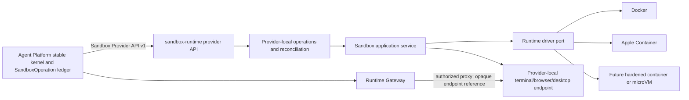

# Architecture

## Purpose

`sandbox-runtime` is a backend-independent sandbox provider. Its first useful
workload is a remote shell, while browser, desktop, GPU, and stronger isolation
backends are optional capabilities that can be added without changing the
provider-facing control protocol.

One explicit compatibility target is
[`CelestialsGroup/agent-blueprints`](https://github.com/CelestialsGroup/agent-blueprints).
That platform defines its own native Sandbox Provider plan and a stable provider
boundary. This project is a candidate independent implementation of that
boundary. DeerFlow and other third-party sandboxes are research references, not
current adapters, dependencies, or data models that this repository should copy.

This document summarizes the upstream contract locked by
[`compatibility/agent-platform/contract.lock.json`](../compatibility/agent-platform/contract.lock.json).
The normative sources remain the locked OpenAPI, JSON Schemas, semantic rules,
fixtures, and Conformance Suite. When this document disagrees with those
resources, the locked contract wins.

## Compatibility boundary

The Agent Platform owns business and orchestration truth:

- tenant, user, authorization, `WorkOrder`, `Run`, and workflow state;
- provider selection and immutable `ProviderRevision` binding for each run;
- operation ledger, attempt/fencing metadata, retries, reconciliation, and
  manual-review decisions;
- artifact metadata, delivery, usage accounting, recordings, and audit policy;
- public Runtime Gateway authentication and session authorization.

`sandbox-runtime` owns provider-local execution truth:

- container, VM, or other isolation-backend resources;
- sandbox observed state and provider-local operation progress;
- process execution, cancellation evidence, and retained results;
- internal runtime endpoints;
- provider snapshot payloads and backend metrics.

It must not become authoritative for Agent Platform users, final work status,
artifact records, billing, or public session credentials. Conversely, the
Agent Platform must not depend on container IDs, Pod names, Apple Container
IDs, host paths, or any other provider implementation detail.



The current `/instances` API is a local management API, not the upstream
Sandbox Provider API. The current `instance.Service` may remain the internal
application boundary and `instance.Driver` the backend port, but neither model
should be serialized directly as the cross-project protocol.

The accepted ownership decision is recorded in
[`docs/adr/0001-agent-platform-provider-boundary.md`](adr/0001-agent-platform-provider-boundary.md).
The Agent Platform owns its durable aggregate operation ledger and authorization
decisions. This service owns only provider-local operation progress and backend
evidence required to answer the Provider API safely.

## Contract source and versioning

The compatibility implementation must be generated or validated against the
immutable upstream revision in the contract lock. The locked contract identifies
itself as Sandbox Provider API `1.0.0`, protocol `v1`:

- [Sandbox Provider contract](https://github.com/CelestialsGroup/agent-blueprints/blob/cf623ac7b6c8730a0a609076adaefe5197488667/blueprint/docs/33_SANDBOX_PROVIDER_CONTRACT.md)
- [Sandbox security and isolation](https://github.com/CelestialsGroup/agent-blueprints/blob/cf623ac7b6c8730a0a609076adaefe5197488667/blueprint/docs/34_SANDBOX_SECURITY_AND_ISOLATION.md)
- [Conformance and migration](https://github.com/CelestialsGroup/agent-blueprints/blob/cf623ac7b6c8730a0a609076adaefe5197488667/blueprint/docs/36_SANDBOX_CONFORMANCE_AND_MIGRATION.md)
- [OpenAPI v1](https://github.com/CelestialsGroup/agent-blueprints/blob/cf623ac7b6c8730a0a609076adaefe5197488667/contract/openapi/sandbox-provider-v1.yaml)
- [JSON Schemas](https://github.com/CelestialsGroup/agent-blueprints/tree/cf623ac7b6c8730a0a609076adaefe5197488667/contract/schemas)
- [Sandbox Conformance Suite](https://github.com/CelestialsGroup/agent-blueprints/blob/cf623ac7b6c8730a0a609076adaefe5197488667/contract/conformance/sandbox/v1/suite.json)

The upstream Contract is marked `LicenseRef-Proprietary`, while this repository
is MIT licensed. Contract resources are therefore consumed from a read-only
checkout and verified by digest; they are not copied into this repository.

Compatibility rules:

1. The Agent Platform selects a provider and immutable ProviderRevision before
   starting a run. A running workload is never silently moved to a different
   revision.
2. Protocol changes are additive within `v1`. A breaking semantic or schema
   change requires a new protocol version.
3. Capability negotiation, not provider-name checks, decides whether a workload
   may be scheduled.
4. A provider switch applies to new runs. Existing runs drain on their original
   revision unless an explicitly compatible workspace snapshot is restored into
   a new sandbox.
5. Upstream contract fixtures and conformance tests are release gates. Narrative
   documentation alone is not sufficient proof of compatibility.

## Provider API v1

The versioned provider surface contains these operation families:

| Method and path | Responsibility |
| --- | --- |
| `GET /v1/capabilities` | Return provider revision, runtime profiles, limits, and supported capability versions. |
| `POST /v1/sandboxes` | Idempotently request sandbox creation. |
| `POST /v1/sandboxes:restore` | Create a new sandbox from a compatible snapshot. |
| `GET /v1/sandboxes/{sandbox_id}` | Read desired/observed state, generations, lease, and opaque references. |
| `POST /v1/sandboxes/{sandbox_id}/desired-state` | Request `ready`, `suspended`, or `terminated`. |
| `POST /v1/sandboxes/{sandbox_id}/lease` | Renew the bounded sandbox lease. |
| `POST /v1/sandboxes/{sandbox_id}/exec` | Start an asynchronous process execution. |
| `POST /v1/sandboxes/{sandbox_id}/exec:cancel` | Record cancellation intent for an execution. |
| `POST /v1/sandboxes/{sandbox_id}/runtime-sessions` | Open an internal terminal, browser, desktop, or port-forward session. |
| `POST /v1/sandboxes/{sandbox_id}/snapshots` | Start snapshot creation at a declared level. |
| `POST /v1/sandboxes/{sandbox_id}:terminate` | Idempotently request teardown. |
| `GET /v1/operations/{operation_id}` | Read durable asynchronous operation state. |
| `GET /v1/operations/{operation_id}/exec-result` | Read a retained execution result. |
| `GET /v1/operations/{operation_id}/snapshot-manifest` | Read a completed snapshot manifest. |
| `GET /v1/sandboxes/{sandbox_id}/events` | Resume a sequenced provider event stream. |

Mutation requests carry an operation envelope with at least `operation_id`,
`attempt_id`, `fencing_token`, `idempotency_key`, deadline, trace context, and a
request digest where applicable. Replaying the same idempotency key and digest
must return the same logical operation. Reusing a key with different content is
a conflict. Stale attempts or fencing tokens must never overwrite newer work.

Provider operations are asynchronous. Their public states are `accepted`,
`running`, `succeeded`, `failed`, `cancelled`, and `outcome_unknown`.
Cancellation is intent, not proof: an operation may be marked `cancelled` only
after provider confirmation or evidence that it was never dispatched. A timeout
or lost response that could have taken effect is `outcome_unknown` and must be
reconciled.

Expected protocol behavior includes:

- `409` for idempotency, generation, fencing, or state conflicts;
- `422` for a syntactically valid but unsupported capability combination;
- `429` for capacity pressure, with `Retry-After`;
- `410` for expired event cursors or retained results;
- `503` for a draining or temporarily unavailable provider, with `Retry-After`;
- resumable, monotonically sequenced events with an explicit cursor-expired
  response instead of silently skipping history.

Production transport uses mutual TLS plus short-lived bearer credentials bound
to the ProviderRevision, operation/attempt, and policy scope. Loopback-only
development mode may make authentication configurable, but production
conformance must not rely on a trusted flat network.

## Capabilities and profiles

The upstream capability vocabulary currently includes:

| Capability | Meaning in this project |
| --- | --- |
| `sandbox.exec` | Run a bounded process and retain a structured result. |
| `sandbox.terminal` | Open an interactive shell through an authorized gateway. |
| `sandbox.browser` | Expose a browser session when a browser runtime exists. |
| `sandbox.desktop` | Expose a desktop session when a desktop runtime exists. |
| `sandbox.port-forward` | Create an authorized, bounded internal forwarding session. |
| `sandbox.workspace.persistent` | Keep `/workspace` data for the declared lifecycle. |
| `sandbox.snapshot.workspace` | Snapshot portable workspace content. |
| `sandbox.snapshot.filesystem` | Snapshot provider-specific filesystem state. |
| `sandbox.snapshot.process` | Snapshot provider-specific process state. |
| `sandbox.restore` | Create a new sandbox from a compatible manifest. |
| `sandbox.network-policy` | Enforce declared `none`, restricted, or trusted egress policy. |
| `sandbox.gpu` | Provide explicitly scheduled GPU resources. |
| `sandbox.nested-container` | Allow a policy-approved nested container runtime. |
| `sandbox.user-namespace` | Apply user-namespace isolation. |

Unsupported required capabilities fail with
`SANDBOX_CAPABILITY_UNSUPPORTED`; they are never silently ignored or degraded.
Optional capabilities may be omitted only when the caller declared them
optional. Capability results include supported versions, compatible runtime
profiles, architectures, and hard limits so scheduling can reject an invalid
request before provisioning.

The standard isolation classes are `container`, `hardened-container`, `microvm`,
`virtual-machine`, and `local-process`. `local-process` is never acceptable for
untrusted public multi-tenant execution. Higher-risk workloads should be routed
to hardened containers or microVMs without changing the Provider API.

For this repository, the first compatibility profile should require lifecycle,
`sandbox.exec`, `sandbox.terminal`, restricted security, and usage evidence.
Browser, desktop, snapshots, GPU, and nested containers remain optional until
their implementations and conformance suites exist. Therefore, “drop-in
replacement” means replacement for a declared capability profile; it must not
claim compatibility with every DeerFlow workload merely because lifecycle
creation works.

## Sandbox model and lifecycle

A backend-independent `SandboxSpec` contains platform-issued sandbox, tenant,
work, workspace, and slot identifiers; immutable provider revision; OCI image
reference and digest; runtime profile; resource limits; required and optional
capabilities; network policy; workspace/snapshot configuration; lease;
placement; and a security baseline. External business clients must not construct
this provider-internal spec directly.

The desired state is one of `ready`, `suspended`, or `terminated`. Observed state
is one of:

```text
requested -> provisioning -> ready -> suspending -> suspended
                            -> terminating -> terminated
                            -> expired
                            -> failed
```

Resume may move `suspended` through `resuming` back to `ready`. Each requested
change increments `generation`; the provider reports `observed_generation` only
after that generation has been applied. This allows multiple reconcilers to
detect stale reads and prevents last-writer-wins corruption.

A workspace may contain multiple named sandbox slots, such as `primary-code`,
`browser`, `desktop`, `subagent/<id>`, or `isolated/<capability>`. Slots can use
different providers, revisions, regions, and profiles. Rebuilding a slot creates
a new sandbox identity and generation; it must not mutate history in place.

Lease expiry is a durable orchestration decision. Provider-local timers are
useful enforcement, but a cache TTL is not the source of truth. Expiry and
termination must be observable, retryable, and reconciled after process restarts.

## Workspace, execution, sessions, and snapshots

Every compatible runtime presents stable guest paths:

| Path | Contract |
| --- | --- |
| `/inputs` | Read-only staged inputs. |
| `/workspace` | Mutable working data, optionally persistent. |
| `/outputs` | Artifact staging area; writing does not itself publish an artifact. |
| `/tmp` | Ephemeral temporary storage with explicit size and mount restrictions. |

An exec request declares argv, working directory, environment references,
stdin policy, timeout, and output bounds. Results distinguish an application
exit from a provider failure and report exit code, signal, truncation, timing,
resource evidence, and stdout/stderr references or bounded inline content.

Runtime sessions return only opaque internal endpoint references with bounded
expiry. Public clients never receive a container IP, Pod address, or backend
token. The Agent Platform Runtime Gateway authorizes and proxies terminal,
browser, desktop, and port-forward traffic and owns reconnect policy and
recording metadata.

Snapshot manifests include provider revision, snapshot level, digest, size,
content reference, and compatibility metadata. Workspace-only snapshots may be
portable across providers. Filesystem and process snapshots are provider/revision
specific unless both sides explicitly declare compatibility. Restore always
creates a new sandbox identity and slot binding; it never rewrites the original.

Files in `/outputs` become platform artifacts only after digest, MIME type,
size, tenant binding, policy, active-content, and malware checks. Provider
storage references are not public artifact URLs.

## Security baseline

The default policy is deny. A container backend must start from this baseline:

- no privileged mode, host network/PID/IPC, host paths, or service-account token;
- no privilege escalation; drop all Linux capabilities and add back only an
  explicitly approved minimum;
- numeric non-root user, `RuntimeDefault` seccomp or stricter, read-only root
  filesystem, and bounded writable mounts;
- resource limits for CPU, memory, PIDs, ephemeral storage, execution time, and
  lease duration;
- no Kubernetes API permission and no long-lived Agent Platform credential;
- no public network egress by default.

Restricted egress must pass through policy enforcement and block cloud metadata,
Kubernetes and cluster-management endpoints, Agent Platform databases/Redis/
Temporal, other tenants, unauthorized object storage, link-local/private-address
redirects, and DNS-rebinding bypasses. Full egress is reserved for explicitly
trusted profiles.

Secrets are delivered through short-lived, least-privilege, revocable grants
bound to a sandbox/work/invocation. Plaintext secrets must not appear in
`SandboxSpec`, logs, events, environment snapshots, or snapshot payloads.

Audit evidence covers create/restore/terminate, image and provider revision,
isolation profile, network-policy decisions, secret grant/revocation, exec
request digest, runtime-session open/close, snapshot lifecycle, denials, and
isolation violations. Sensitive command output and secret values are not audit
metadata.

## Error model

The Provider API returns a stable machine code, safe message, retryability,
operation/attempt identity, and trace correlation. At minimum it recognizes:

```text
SANDBOX_SPEC_INVALID
SANDBOX_CAPABILITY_UNSUPPORTED
SANDBOX_POLICY_DENIED
SANDBOX_QUOTA_EXCEEDED
SANDBOX_IMAGE_NOT_FOUND
SANDBOX_IMAGE_PULL_FAILED
SANDBOX_PROVISIONING_FAILED
SANDBOX_UNAVAILABLE
SANDBOX_LEASE_EXPIRED
SANDBOX_GENERATION_CONFLICT
SANDBOX_STALE_FENCING_TOKEN
SANDBOX_EXEC_FAILED
SANDBOX_EXEC_OUTCOME_UNKNOWN
SANDBOX_SESSION_EXPIRED
SANDBOX_SNAPSHOT_FAILED
SANDBOX_RESTORE_INCOMPATIBLE
SANDBOX_TERMINATION_FAILED
```

Provider errors distinguish `known_failed` from `outcome_unknown`. Internal
backend errors are translated at the adapter boundary; Docker/containerd/Apple
Container error strings and identifiers must not leak into the stable contract.

## Internal component boundaries

The target package direction is:

```text
providerapi  -> sandbox application service -> operation/repository ports
                                          \-> runtime/session/snapshot ports
driver/*     --------------------------------> backend engines
```

- `providerapi` owns versioned HTTP/SSE encoding, authentication hooks, request
  limits, validation, and stable error mapping.
- the sandbox application service owns lifecycle policy, generations, leases,
  capability validation, and coordination; it has no HTTP or Docker knowledge.
- the provider-local operation coordinator owns the idempotency, attempts,
  fencing, deadlines, cancellation evidence, and reconciliation needed to
  execute and report one Provider API request safely. It does not replace the
  Agent Platform's authoritative SandboxOperation ledger.
- repositories persist sandboxes, operations, events, leases, and retained
  results through explicit interfaces. A file repository remains suitable for
  single-process development, not multi-controller production.
- runtime drivers own only backend resource actions and observations. Driver
  methods use backend-neutral value objects and return typed observations.
- session and snapshot ports are separate optional interfaces so implementing a
  Docker lifecycle driver does not falsely advertise terminal or snapshot
  support.

Capability interfaces should be composed instead of growing one mandatory
driver interface indefinitely. The provider advertises a capability only when
the selected revision, runtime profile, driver, and required sidecars all pass
its conformance tests.

## Current gap assessment

The current code is a sound lifecycle foundation, but it is not yet an
Agent Platform-compatible provider:

| Area | Current state | Required direction |
| --- | --- | --- |
| Backend abstraction | `instance.Driver` separates lifecycle from Docker. | Keep internal; add optional exec/session/snapshot capability ports. |
| Lifecycle recovery | Single-process service reconciles persisted records and backend resources. | Add desired/observed generations, durable operations, fencing, leases, and unknown-outcome reconciliation. |
| Persistence | Memory and atomically replaced file repository. | Retain for development; introduce transactional production storage before multi-controller operation. |
| API | Synchronous local `/instances` CRUD. | Add a separate versioned Provider API v1 with async operation resources and resumable events. |
| Capabilities | Shell workload label only. | Add versioned capability discovery and profile/limit validation. |
| Execution | Not implemented. | Add bounded async exec, cancellation evidence, retained results, and usage evidence. |
| Terminal | Not implemented. | Add an internal terminal endpoint and gateway-safe opaque session reference. |
| Workspace | Only bounded `/tmp`; root is read-only. | Add the four stable paths, quotas, ownership, staging, and cleanup policy. |
| Security | Docker defaults already drop capabilities, use non-root/read-only root, disable networking, and limit resources. | Add policy enforcement, stronger isolation profiles, secret grants, egress controls, audit evidence, and production auth. |
| Events and usage | Not implemented. | Add durable sequenced events and provider evidence suitable for platform accounting. |
| Snapshots/browser/desktop | Not implemented and not advertised. | Keep optional until implemented and independently conformant. |

## Delivery plan and release gates

### Phase 1: stable provider core

#### P1.0: contract intake and ownership freeze

- record the independent Provider ownership decision;
- pin the upstream revision, Contract tree, manifest, OpenAPI, and Sandbox Suite;
- verify the lock against a read-only upstream checkout in CI;
- keep upstream proprietary resources outside this MIT repository;
- define development and compatibility change rules.

Release gate: the lock verifier passes and this repository contains no copied
upstream Contract resources. This gate proves input identity only, not protocol
conformance.

#### P1.1: Provider API admission

Implementation slices and evidence boundaries are tracked in the
[P1.1 Provider API admission plan](plan/p1.1-provider-api-admission.md).

- define provider DTOs separately from `instance` and driver models;
- generate or validate them against the locked Schemas and fixtures;
- implement mTLS-only capability discovery;
- implement the closed JWS header, claims, operation, descriptor, and request
  digest admission boundary for all protected operations.

Release gate: Schema/fixture compatibility, mTLS discovery, token binding,
digest substitution, expiry, replay, and stale-fencing admission tests pass.

#### P1.2: asynchronous lifecycle

- add durable sandbox/operation/event records, idempotency, generation, fencing,
  deadlines, leases, and restart reconciliation;
- expose the lifecycle subset of Provider API v1 with standard errors.

Release gate: lifecycle, duplicate request, restart, stale fencing, generation
conflict, create/terminate race, lease expiry, orphan cleanup, and security-base
conformance tests pass.

### Phase 2: coding and remote-shell profile

- implement stable workspace mounts and lifecycle;
- implement bounded async exec, cancel, result retention, and usage evidence;
- implement terminal sessions through an opaque internal endpoint;
- integrate artifact staging without making the provider the artifact authority.

Release gate: Agent Platform coding and shell scenarios run against this provider
without DeerFlow-specific fields, endpoint leakage, or cross-tenant access.

### Phase 3: migration readiness

- run the Agent Platform native provider and `sandbox-runtime` against the same
  locked Conformance Suite;
- shadow-validate capabilities and requests without serving production traffic;
- canary only new runs and lock each run to its selected ProviderRevision;
- prove rollback changes only new bindings and old-provider runs can drain;
- compare lifecycle latency, exec success, orphan count, session stability,
  resource evidence, and reconciliation backlog.

Release gate: the platform can switch the matching capability profile by
configuration without changing WorkOrder, Artifact, event, usage, gateway, or
frontend contracts.

### Phase 4: optional profiles

Add browser, desktop, port forwarding, snapshots/restore, GPU, nested-container,
and stronger isolation profiles one at a time. Each capability requires its own
security, fault-injection, concurrency, session, and usage conformance tests
before advertisement.

## Conformance matrix

Every provider revision must be tested for:

- lifecycle faults: duplicate create, control-plane/provider restart, backend
  loss, lease expiry, retrying termination, and orphan cleanup;
- concurrency: create/terminate, exec/terminate, snapshot/write, multiple
  reconcilers, stale fencing, and generation conflicts;
- security: cross-tenant filesystem/network attempts, cloud metadata,
  Kubernetes API, host filesystem, privilege escalation, expired/revoked secret,
  and egress-policy bypass;
- sessions: endpoint non-disclosure, authorization and expiry, gateway reconnect,
  and behavior after sandbox rebuild;
- usage: wall time, CPU, memory, network, storage, execution count, and evidence
  correlation;
- snapshots when supported: digest verification, incompatibility rejection,
  secret exclusion, and restore into a new identity.

No provider revision is “compatible” based only on unit tests or a successful
container launch. Compatibility is the tested combination of protocol version,
capability set, runtime profile, architecture, driver, image digest, and security
policy.
