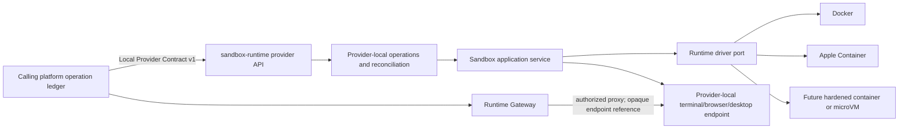

# Architecture

## Purpose

`sandbox-runtime` is a backend-independent sandbox provider. Its first useful
workload is a remote shell, while browser, desktop, GPU, and stronger isolation
backends are optional capabilities that can be added without changing the
provider-facing control protocol.

The Provider boundary is defined by the repository-owned MIT Contract under
[`contract/`](../contract/). Its normative resources are the locked OpenAPI,
JSON Schemas, semantic rules, fixtures, and Conformance Suite. The lock is
recorded in [`compatibility/sandbox-runtime/contract.lock.json`](../compatibility/sandbox-runtime/contract.lock.json).
This repository no longer consumes or claims compatibility with an external
Agent Platform Contract. A future adapter may be added as a separate,
explicitly versioned compatibility layer.

## Compatibility boundary

A calling platform owns business and orchestration truth:

- tenant, user, authorization, `WorkOrder`, `Run`, and workflow state;
- provider selection and immutable `ProviderRevision` binding for each run;
- operation ledger, attempt/fencing metadata, retries, reconciliation, and
  manual-review decisions;
- artifact metadata, delivery, usage accounting, recordings, and audit policy;
- public Runtime Gateway authentication and session authorization.

`sandbox-runtime` owns provider-local execution truth:

- container, VM, or other isolation-backend resources;
- sandbox observed state and provider-local operation progress;
- process execution, cancellation evidence, and retained results;
- internal runtime endpoints;
- provider snapshot payloads and backend metrics.

It must not become authoritative for caller users, final work status,
artifact records, billing, or public session credentials. Conversely, the
calling platform must not depend on container IDs, Pod names, Apple Container
IDs, host paths, or any other provider implementation detail.



The current `/instances` API is a local management API, not the Provider
Contract API. The current `instance.Service` may remain the internal
application boundary and `instance.Driver` the backend port, but neither model
should be serialized directly as the cross-project protocol.

The accepted ownership decision is recorded in
[`docs/adr/0001-agent-platform-provider-boundary.md`](adr/0001-agent-platform-provider-boundary.md).
The calling platform owns its durable aggregate operation ledger and authorization
decisions. This service owns only provider-local operation progress and backend
evidence required to answer the Provider API safely.

## Contract source and versioning

The current Contract namespace is
`urn:shell-echo:sandbox-runtime:provider-v1`, version `1.0.0`, and MIT licensed.
The lock binds the Contract tree, manifest, OpenAPI digest, semantic rules,
fixtures, and local Conformance Suite to an immutable Git revision. Contract
resources are validated in place; no external checkout, source-root mount, or
proprietary resource is required.

Compatibility rules:

1. Protocol changes are additive within `v1`. A breaking semantic or schema
   change requires a new protocol version and namespace revision.
2. Capability negotiation, not provider-name checks, decides whether a workload
   may be scheduled.
3. Provider revision identifiers remain immutable for the lifetime of an
   admitted workload.
4. Local fixtures and conformance tests are release gates. Narrative
   documentation alone is not sufficient proof of Contract compatibility.

## Provider API v1

The versioned provider surface contains these operation families:

The table is the target architecture inventory. The current repository-owned
Contract authorizes the coding/shell surface plus browser capability, create,
session-open, opaque-handoff, operation, usage, and admission authority. The
Provider implementation composes the coding/shell development surface only.
The two browser-session routes remain deliberately absent from the protected
router, startup advertisement remains empty unless the existing coding/shell
dependency graph passes, and no browser runtime or Gateway is composed.

| Method and path | Responsibility |
| --- | --- |
| `GET /v1/capabilities` | Return provider revision, runtime profiles, limits, and supported capability versions. |
| `POST /v1/sandboxes` | Idempotently request sandbox creation. |
| `POST /v1/sandboxes:restore` | Create a new sandbox from a compatible snapshot. |
| `GET /v1/sandboxes/{sandbox_id}` | Read desired/observed state, generations, lease, and opaque references. |
| `POST /v1/sandboxes/{sandbox_id}/desired-state` | Request `ready`, `suspended`, or `terminated`. |
| `POST /v1/sandboxes/{sandbox_id}/lease` | Renew the bounded sandbox lease. |
| `POST /v1/sandboxes/{sandbox_id}/exec` | Start an asynchronous process execution. |
| `POST /v1/sandboxes/{sandbox_id}/exec:cancel` | Record cancellation intent for an execution. |
| `POST /v1/sandboxes/{sandbox_id}/runtime-sessions` | Open an internal terminal session. Browser authority does not reuse this route. |
| `POST /v1/sandboxes/{sandbox_id}/browser-sessions` | Contract-authorized asynchronous browser session request; currently absent from Provider composition. |
| `POST /v1/sandboxes/{sandbox_id}/snapshots` | Start snapshot creation at a declared level. |
| `POST /v1/sandboxes/{sandbox_id}:terminate` | Idempotently request teardown. |
| `GET /v1/operations/{operation_id}` | Read durable asynchronous operation state. |
| `GET /v1/operations/{operation_id}/runtime-session` | Read an opaque terminal session handoff after a successful session operation. |
| `GET /v1/operations/{operation_id}/browser-session` | Contract-authorized opaque browser handoff for caller-owned Gateway resolution; currently absent from Provider composition. |
| `GET /v1/operations/{operation_id}/exec-result` | Read a retained execution result. |
| `GET /v1/operations/{operation_id}/snapshot-manifest` | Read a completed snapshot manifest. |
| `GET /v1/sandboxes/{sandbox_id}/events` | Resume a sequenced provider event stream. |

Mutation requests carry an operation envelope with at least `operation_id`,
`attempt_id`, `fencing_token`, `idempotency_key`, deadline, trace context, and a
request digest where applicable. Replaying the same idempotency key and digest
must return the same logical operation. Reusing a key with different content is
a conflict. Stale attempts or fencing tokens must never overwrite newer work.

Provider operations are asynchronous. Their public states are `accepted`,
`running`, `succeeded`, `failed`, `cancelled`, and `outcome_unknown`.
Cancellation is intent, not proof: an operation may be marked `cancelled` only
after provider confirmation or evidence that it was never dispatched. A timeout
or lost response that could have taken effect is `outcome_unknown` and must be
reconciled.

Expected protocol behavior includes:

- `409` for idempotency, generation, fencing, or state conflicts;
- `422` for a syntactically valid but unsupported capability combination;
- `429` for capacity pressure, with `Retry-After`;
- `410` for expired event cursors or retained results;
- `503` for a draining or temporarily unavailable provider, with `Retry-After`;
- resumable, monotonically sequenced events with an explicit cursor-expired
  response instead of silently skipping history.

Production transport uses mutual TLS plus short-lived bearer credentials bound
to the ProviderRevision, operation/attempt, and policy scope. Loopback-only
development mode may make authentication configurable, but production
conformance must not rely on a trusted flat network.

## Capabilities and profiles

The Contract capability vocabulary currently includes:

| Capability | Meaning in this project |
| --- | --- |
| `sandbox.exec` | Run a bounded process and retain a structured result. |
| `sandbox.terminal` | Open an interactive shell through an authorized gateway. |
| `sandbox.browser` | Expose a browser session when a browser runtime exists. |
| `sandbox.desktop` | Expose a desktop session when a desktop runtime exists. |
| `sandbox.port-forward` | Create an authorized, bounded internal forwarding session. |
| `sandbox.workspace.persistent` | Keep `/workspace` data for the declared lifecycle. |
| `sandbox.snapshot.workspace` | Snapshot portable workspace content. |
| `sandbox.snapshot.filesystem` | Snapshot provider-specific filesystem state. |
| `sandbox.snapshot.process` | Snapshot provider-specific process state. |
| `sandbox.restore` | Create a new sandbox from a compatible manifest. |
| `sandbox.network-policy` | Enforce declared `none`, restricted, or trusted egress policy. |
| `sandbox.gpu` | Provide explicitly scheduled GPU resources. |
| `sandbox.nested-container` | Allow a policy-approved nested container runtime. |
| `sandbox.user-namespace` | Apply user-namespace isolation. |

Unsupported required capabilities fail with
`SANDBOX_CAPABILITY_UNSUPPORTED`; they are never silently ignored or degraded.
Optional capabilities may be omitted only when the caller declared them
optional. Capability results include supported versions, compatible runtime
profiles, architectures, and hard limits so scheduling can reject an invalid
request before provisioning.

The standard isolation classes are `container`, `hardened-container`, `microvm`,
`virtual-machine`, and `local-process`. `local-process` is never acceptable for
untrusted public multi-tenant execution. Higher-risk workloads should be routed
to hardened containers or microVMs without changing the Provider API.

For this repository, the first compatibility profile should require lifecycle,
`sandbox.exec`, `sandbox.terminal`, restricted security, and usage evidence.
Browser, desktop, snapshots, GPU, and nested containers remain optional until
their implementations and conformance suites exist. Therefore, “drop-in
replacement” means replacement for a declared capability profile; it must not
claim compatibility with every DeerFlow workload merely because lifecycle
creation works.

## Sandbox model and lifecycle

A backend-independent `SandboxSpec` contains platform-issued sandbox, tenant,
work, workspace, and slot identifiers; immutable provider revision; OCI image
reference and digest; runtime profile; resource limits; required and optional
capabilities; network policy; workspace/snapshot configuration; lease;
placement; and a security baseline. External business clients must not construct
this provider-internal spec directly.

The desired state is one of `ready`, `suspended`, or `terminated`. Observed state
is one of:

```text
requested -> provisioning -> ready -> suspending -> suspended
                            -> terminating -> terminated
                            -> expired
                            -> failed
```

Resume may move `suspended` through `resuming` back to `ready`. Each requested
change increments `generation`; the provider reports `observed_generation` only
after that generation has been applied. This allows multiple reconcilers to
detect stale reads and prevents last-writer-wins corruption.

A workspace may contain multiple named sandbox slots, such as `primary-code`,
`browser`, `desktop`, `subagent/<id>`, or `isolated/<capability>`. Slots can use
different providers, revisions, regions, and profiles. Rebuilding a slot creates
a new sandbox identity and generation; it must not mutate history in place.

Lease expiry is a durable orchestration decision. Provider-local timers are
useful enforcement, but a cache TTL is not the source of truth. Expiry and
termination must be observable, retryable, and reconciled after process restarts.

## Workspace, execution, sessions, and snapshots

Every compatible runtime presents stable guest paths:

| Path | Contract |
| --- | --- |
| `/inputs` | Read-only staged inputs. |
| `/workspace` | Mutable working data, optionally persistent. |
| `/outputs` | Artifact staging area; writing does not itself publish an artifact. |
| `/tmp` | Ephemeral temporary storage with explicit size and mount restrictions. |

An exec request declares argv, working directory, environment references,
stdin policy, timeout, and output bounds. Results distinguish an application
exit from a provider failure and report exit code, signal, truncation, timing,
resource evidence, and stdout/stderr references or bounded inline content.

Runtime sessions return only opaque internal endpoint references with bounded
expiry. Public clients never receive a container IP, Pod address, or backend
token. The Agent Platform Runtime Gateway authorizes and proxies terminal,
browser, desktop, and port-forward traffic and owns reconnect policy and
recording metadata.

Terminal reconnect requires a runtime resource that can be independently
reattached after the Provider process loses its in-memory stream. A one-shot
Docker exec attach, persisted backend exec ID, or replacement shell process is
not equivalent. Provider-neutral session state stores only bounded allocation
evidence, opaque reference, connection generation, and expiry; backend broker
identity stays in adapter-private state. The Gateway resolves the opaque
reference into a fresh dial operation on every connection attempt. Its
authorizer, revocation source, and recorder remain caller-owned dependencies
with no Provider-supplied allow-all fallback.

Snapshot manifests include provider revision, snapshot level, digest, size,
content reference, and compatibility metadata. Workspace-only snapshots may be
portable across providers. Filesystem and process snapshots are provider/revision
specific unless both sides explicitly declare compatibility. Restore always
creates a new sandbox identity and slot binding; it never rewrites the original.

Files in `/outputs` become platform artifacts only after digest, MIME type,
size, tenant binding, policy, active-content, and malware checks. Provider
storage references are not public artifact URLs.

## Security baseline

The default policy is deny. A container backend must start from this baseline:

- no privileged mode, host network/PID/IPC, host paths, or service-account token;
- no privilege escalation; drop all Linux capabilities and add back only an
  explicitly approved minimum;
- numeric non-root user, `RuntimeDefault` seccomp or stricter, read-only root
  filesystem, and bounded writable mounts;
- resource limits for CPU, memory, PIDs, ephemeral storage, execution time, and
  lease duration;
- no Kubernetes API permission and no long-lived Agent Platform credential;
- no public network egress by default.

Restricted egress must pass through policy enforcement and block cloud metadata,
Kubernetes and cluster-management endpoints, Agent Platform databases/Redis/
Temporal, other tenants, unauthorized object storage, link-local/private-address
redirects, and DNS-rebinding bypasses. Full egress is reserved for explicitly
trusted profiles.

Secrets are delivered through short-lived, least-privilege, revocable grants
bound to a sandbox/work/invocation. Plaintext secrets must not appear in
`SandboxSpec`, logs, events, environment snapshots, or snapshot payloads.

Audit evidence covers create/restore/terminate, image and provider revision,
isolation profile, network-policy decisions, secret grant/revocation, exec
request digest, runtime-session open/close, snapshot lifecycle, denials, and
isolation violations. Sensitive command output and secret values are not audit
metadata.

## Error model

The Provider API returns a stable machine code, safe message, retryability,
operation/attempt identity, and trace correlation. At minimum it recognizes:

```text
SANDBOX_SPEC_INVALID
SANDBOX_CAPABILITY_UNSUPPORTED
SANDBOX_POLICY_DENIED
SANDBOX_QUOTA_EXCEEDED
SANDBOX_IMAGE_NOT_FOUND
SANDBOX_IMAGE_PULL_FAILED
SANDBOX_PROVISIONING_FAILED
SANDBOX_UNAVAILABLE
SANDBOX_LEASE_EXPIRED
SANDBOX_GENERATION_CONFLICT
SANDBOX_STALE_FENCING_TOKEN
SANDBOX_EXEC_FAILED
SANDBOX_EXEC_OUTCOME_UNKNOWN
SANDBOX_SESSION_EXPIRED
SANDBOX_SNAPSHOT_FAILED
SANDBOX_RESTORE_INCOMPATIBLE
SANDBOX_TERMINATION_FAILED
```

Provider errors distinguish `known_failed` from `outcome_unknown`. Internal
backend errors are translated at the adapter boundary; Docker/containerd/Apple
Container error strings and identifiers must not leak into the stable contract.

## Internal component boundaries

The target package direction is:

```text
providerapi  -> sandbox application service -> operation/repository ports
                                          \-> runtime/session/snapshot ports
driver/*     --------------------------------> backend engines
```

- `providerapi` owns versioned HTTP/SSE encoding, authentication hooks, request
  limits, validation, and stable error mapping.
- the sandbox application service owns lifecycle policy, generations, leases,
  capability validation, and coordination; it has no HTTP or Docker knowledge.
- the provider-local operation coordinator owns the idempotency, attempts,
  fencing, deadlines, cancellation evidence, and reconciliation needed to
  execute and report one Provider API request safely. It does not replace the
  calling platform's authoritative operation ledger.
- repositories persist sandboxes, operations, events, leases, and retained
  results through explicit interfaces. A file repository remains suitable for
  single-process development, not multi-controller production.
- runtime drivers own only backend resource actions and observations. Driver
  methods use backend-neutral value objects and return typed observations.
- session and snapshot ports are separate optional interfaces so implementing a
  Docker lifecycle driver does not falsely advertise terminal or snapshot
  support.

Capability interfaces should be composed instead of growing one mandatory
driver interface indefinitely. The provider advertises a capability only when
the selected revision, runtime profile, driver, and required sidecars all pass
its conformance tests.

## Current gap assessment

The current code has passed its named reference coding/shell caller gate and
has browser Contract authority plus a separately verified image component; the
broader reliability, security, deployment, and optional-profile gates remain
open:

| Area | Current state | Required direction |
| --- | --- | --- |
| Backend abstraction | Local `instance.Driver` remains separate; the Provider lifecycle has its own fake and Docker development adapters, while exec and terminal use focused Provider-only runtime ports. | Add future snapshot capability ports without reusing `/instances` models and retain narrow optional interfaces. |
| Lifecycle recovery | Provider file persistence and Docker observation reconcile pending/unknown create work for one controller. | Retain unknown-outcome evidence; add transactional production storage before multi-controller operation. |
| Persistence | Memory and atomically replaced file repository. | Retain for development; introduce transactional production storage before multi-controller operation. |
| API | Local `/instances` and the protected Provider v1 surface are separate; authorized coding/shell lifecycle/session/artifact/usage routes have bounded projections, and development exec routes reach a real Docker executor. Browser routes are Contract-authorized but explicitly uncomposed and return `404`. | Add browser transport only after its runtime/session application and private Gateway dependencies pass their component gates. |
| Capabilities | Empty, terminal-only, atomic coding/shell, and browser-only snapshots are locked; browser validation is projection authority only and command startup does not advertise it. | Advertise browser only after its complete image, runtime, Gateway, evidence, security, and independent-caller gates pass. |
| Execution | P2.5e composes durable exec/cancel/result/operation handling with real Docker execution, private bounded capture, cancellation, expiry, and reconciliation for one development controller; local gates and CI pass. | Retain the recovery/correlation gates and complete real usage collection in P2.5g; do not advertise before P2.5h. |
| Terminal | P2.5f1 adds a backend-neutral terminal runtime, PTY-owning guest broker, and Docker adapter with private durable identity, bounded capacity, cleanup, and same-shell reattach after Provider driver reconstruction. P2.5f2 adds an uncomposed single-controller session vertical with durable accept-before-allocation, provider-neutral receipts/observations, lifecycle projection, restart reconciliation, cleanup retry, and v1-to-v2 migration. P2.5f3 adds a separate durable opaque-reference registry/resolver that rechecks registry and committed-handoff bindings before every fresh attach. P2.5f4 adds bounded WebSocket and terminal-byte-stream adapters outside Gateway policy, with mandatory caller handshake admission, explicit origin allowlists, disabled compression, and 32 KiB default / 64 KiB hard frame limits. | Compose the existing Gateway only with caller-owned authorization, revocation, and recording ports, then add command composition and the evidence gate through P2.5f7. The separate session/reference repositories are non-atomic; do not infer multi-controller, external-caller, or production readiness. |
| Workspace | The Provider Docker development adapter supplies `/inputs`, `/workspace`, `/outputs`, and bounded tmpfs `/tmp` with owned cleanup; exec consumes that runtime without exposing host paths. | Add artifact consumers, capacity enforcement, and stronger isolation evidence. |
| Security | Docker defaults already drop capabilities, use non-root/read-only root, disable networking, and limit resources. | Add policy enforcement, stronger isolation profiles, secret grants, egress controls, audit evidence, and production auth. |
| Events and usage | Durable lifecycle events and bounded usage-evidence components exist without a complete runtime collector composition. | Complete collection/reconciliation while leaving platform accounting authority outside the Provider. |
| Snapshots/browser/desktop | Browser Contract authority/projection is locked and the digest-pinned browser image component passes local dual-architecture smoke/reproducibility checks, but browser runtime/session/routes/advertisement are not composed; snapshots and desktop remain unauthorized optional behavior. | Implement and verify uncomposed browser runtime/session/evidence components, then keep every optional profile unadvertised until its independent gates pass. |

## Delivery plan and release gates

### Phase 1: stable provider core

#### P1.0: local Contract ownership freeze

- record the independent Provider ownership decision;
- pin the repository-owned Contract tree, manifest, OpenAPI, semantic rules,
  fixtures, and Conformance Suite;
- verify the lock against this repository in CI;
- keep the Contract MIT-licensed and versioned in this repository;
- define development and compatibility change rules.

Release gate: the local lock verifier and resource validation pass. This gate
proves Contract identity only, not protocol conformance.

#### P1.1: Provider API admission

Implementation slices and evidence boundaries are tracked in the
[P1.1 Provider API admission plan](plan/p1.1-provider-api-admission.md).

- define provider DTOs separately from `instance` and driver models;
- validate them against the locked local Schemas and fixtures;
- implement mTLS-only capability discovery;
- implement the closed JWS header, claims, operation, descriptor, and request
  digest admission boundary for all protected operations.

Release gate: Schema/fixture compatibility, mTLS discovery, token binding,
digest substitution, expiry, replay, and stale-fencing admission tests pass.

#### P1.2: asynchronous lifecycle

- add durable sandbox/operation/event records, idempotency, generation, fencing,
  deadlines, leases, and restart reconciliation;
- expose the lifecycle subset of Provider API v1 with standard errors.

Release gate: lifecycle, duplicate request, restart, stale fencing, generation
conflict, create/terminate race, lease expiry, orphan cleanup, and security-base
conformance tests pass.

### Phase 2: coding and remote-shell profile

- implement stable workspace mounts and lifecycle;
- implement bounded async exec, cancel, result retention, and usage evidence;
- implement terminal sessions through an opaque internal endpoint;
- integrate artifact staging without making the provider the artifact authority.

Release gate: a separately supplied caller can run its coding and shell
scenarios against this provider without endpoint leakage or cross-tenant access.

### Phase 3: migration readiness

- run an external caller and `sandbox-runtime` against the same locked local
  Conformance Suite;
- shadow-validate capabilities and requests without serving production traffic;
- canary only new runs and lock each run to its selected ProviderRevision;
- prove rollback changes only new bindings and old-provider runs can drain;
- compare lifecycle latency, exec success, orphan count, session stability,
  resource evidence, and reconciliation backlog.

Release gate: the caller can switch the matching capability profile by
configuration without changing WorkOrder, Artifact, event, usage, gateway, or
frontend contracts.

### Phase 4: optional profiles

Add browser, desktop, port forwarding, snapshots/restore, GPU, nested-container,
and stronger isolation profiles one at a time. Each capability requires its own
security, fault-injection, concurrency, session, and usage conformance tests
before advertisement.

## Conformance matrix

Every provider revision must be tested for:

- lifecycle faults: duplicate create, control-plane/provider restart, backend
  loss, lease expiry, retrying termination, and orphan cleanup;
- concurrency: create/terminate, exec/terminate, snapshot/write, multiple
  reconcilers, stale fencing, and generation conflicts;
- security: cross-tenant filesystem/network attempts, cloud metadata,
  Kubernetes API, host filesystem, privilege escalation, expired/revoked secret,
  and egress-policy bypass;
- sessions: endpoint non-disclosure, authorization and expiry, gateway reconnect,
  and behavior after sandbox rebuild;
- usage: wall time, CPU, memory, network, storage, execution count, and evidence
  correlation;
- snapshots when supported: digest verification, incompatibility rejection,
  secret exclusion, and restore into a new identity.

No provider revision is “compatible” based only on unit tests or a successful
container launch. Compatibility is the tested combination of protocol version,
capability set, runtime profile, architecture, driver, image digest, and security
policy.
