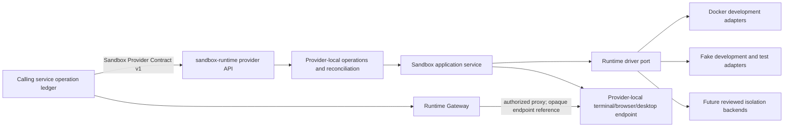

# Architecture

The fixed P2.7 delivery plan is complete at **24/24**, and the independently
owned external-caller plan is complete at **13/13**. Final hosted run
`35203241121` qualified the exact coding/shell caller and Provider revisions,
profile, topology, artifacts, 15 initial scenarios, 5 reconstruction
scenarios, 91 required observations, and stable zero-resource cleanup.

This result closes the named first-version interoperability gate. It does not
establish aggregate conformance, multi-controller correctness, hostile
multi-tenant isolation, HA, deployment readiness, or production readiness.
Detailed identities and evidence are maintained in [`STATUS.md`](STATUS.md);
the architectural ownership and release boundaries below remain authoritative.

The [Product v1 architecture Phase 1](plan/product-v1-phase-1.md) separately
defines a target Product that may live in this repository only as a caller of
the Provider. Its independent design authority is the content-locked
[`product-contract/`](../product-contract/), with repository, state, identity,
Gateway/recording, and deployment decisions in ADRs 0042-0047. This is target
architecture authority. Product Phase 3 Slices 1-13 now implement the Product
import boundary and Contract verifier, PostgreSQL authority, authenticated
Workspace/control/session API, locked network-only Provider reconciliation,
encrypted one-use terminal grants, a bounded Product Terminal Gateway, an
outbound challenge-authenticated Guest Agent channel, confined file
observation, durable file-change cursors, resumable content-addressed
transfers, Workspace revision CAS, a secure browser BFF/Web client, artifact
catalogs, encrypted/redacted recording content with retention cleanup, and a
tenant-aware dependency-derived capability source. The bounded tagged
standalone gate passed through four separate role processes and fresh pinned
PostgreSQL. There is still no deployment-qualified Product process topology.

The [Product v1 Phase 2 Provider lifecycle plan](plan/product-v1-phase-2-provider-lifecycle.md)
is complete for its fixed nine-step scope. Implementation
`98995384c60a924f25ca58d3b7e561207bfa5be8` is selected by lock revision
`3caf38c6bc0b62d2eeb2c1e1c4ed473fae5baab1`; the clean-VCS 60-case Suite,
tagged Docker lifecycle gate, and repository-owned 15+5+9 independent-process
reference run pass within their recorded boundaries.

The [Product v1 Phase 3 plan](plan/product-v1-phase-3-product-kernel-terminal-files-web.md)
is complete for its bounded standalone scope. Its 13 dependency-ordered slices start with Product authority and
persistence, then add Provider reconciliation, authorization, Terminal,
Gateway, Guest Agent/Files, Web, recording, and a standalone integrated gate.
Slice 13 passed nine exact scenarios with cleanup and a strictly validated
manifest. It remains same-repository process evidence using a locked-wire
Provider fixture, not a deployable, independent-caller, HA, hostile-tenant, or
production result.

The [Product v1 Phase 4 Browser plan](plan/product-v1-phase-4-browser.md) is
separate from the historical Provider optional-profile phase described later
in this document. Product Phase 4 is complete at 13/13 for its bounded release
scope. Slices 1-12 add
Product-owned Browser slot/session authority, exact-revision Provider
adaptation and lifecycle recovery, public automation and WebRTC live data
planes, viewer/controller fencing, deny-by-default interaction policy,
immutable runtime and restricted-egress composition, reconnection and visual
resynchronization, encrypted quota-bounded recording, plus the authenticated
Product Web Browser/BFF experience. Slice 13 passes 12 exact scenarios through
separate Product, Gateway, Provider, and Browser processes using fresh
digest-pinned PostgreSQL and Valkey and fresh encrypted recording storage.
These are bounded component, real-adapter, same-repository separate-process,
Docker, PostgreSQL, WebRTC, and headless-browser results. The result does not
establish a deployment-qualified topology, independently implemented caller,
HA, hostile multi-tenant isolation, or production readiness.

The [Product v1 Phase 5 Desktop plan](plan/product-v1-phase-5-desktop-development-unified-product.md)
is now **15/15 complete** for its bounded same-repository
independent-process topology. Slice 1 is deliberately Contract-first: it adds a
separate Provider Desktop capability/profile/runtime, open/read/opaque-handoff/
close lifecycle, expiry and revocation, usage evidence, strict admission and
security semantics, fixtures, and executable local Conformance mappings. The
selected authority is revision `720ad15c343e71f36615dc4499edd5e764178bca`,
tree `343ffde0819207cf99c005096c336735dd33a735`, with a 71-case local Suite.
Slice 2 adds Product-owned Desktop slot/session intent and PostgreSQL
state/outbox isolation with exact profiles, quotas, atomic audit, concurrency
closure, nondisclosure, and restart-safe reads. Slice 3 adds a separate
Provider-local Desktop domain, durable memory/atomic-file authority,
fencing/replay/deadline policy, restart and unknown-outcome reconciliation,
operation aggregation, and optional protected handlers. It adds no Desktop
runtime adapter, private resolver, dispatcher, production startup composition,
public data plane, Web feature, advertisement, deployment, or production
evidence. Slice 4's local locked image/broker candidate at
`163dd8a258a24cf4727169b1cbd8ed7c0fe29292` passes native arm64 smoke.
Publication run `35447651328` at source
`e4a940bda6c5172a78d0dbe40963ca1a99911976` additionally passes native
amd64/arm64/v8 gates, publishes exact signed index
`sha256:638e97c694ad4c9b9d750ae30dc6088ff5011af570ba1b12fdf3f0e35ffa0300`,
and passes fresh independent provenance and platform-matrix verification.
Slice 5 implementation `0c30d6f5e6e0c6227069b8689668a1a0dcfb940b`
adds the Provider-local fail-closed Docker adapter, signed-publication
selection, durable opaque reference authority, fresh attach/reconnect checks,
Desktop lifecycle readiness, revocation/cleanup/absence ordering, and exact
duration usage. Slice 6 implementation
`2d5bbaee2db2ab5c2a85f67e39acf2dd7b82a240` adds the locked network-only
Product adapter, isolated Desktop dispatch/observation, retained recovery,
separate Product/Provider generations, and Desktop-specific close cleanup with
real PostgreSQL evidence. Slice 7 implementation
`0649d62911abb89229de40136347286736152ec6` adds Product-owned Desktop
viewer/controller grants, encrypted one-use tickets, session-scoped controller
fencing, independent quotas, revocation, continuous full-binding authority
checks, and metadata-only audit. At that boundary it remained uncomposed in
production startup and discovery, and no public Desktop signaling/media/input
path existed.

Slice 8 implementation `040c560f3701b7c972c25f05928dd435d9f55c20`
adds a separate bounded Product Desktop WebRTC handler with authenticated
encrypted signaling, receive-only VP8 and optional Opus, viewer/controller
separation, reliable ordered fenced input, continuous grant checks, and
backpressure closure. Durable Desktop policy, a real Provider media bridge,
recovery, recording, production composition, and discovery remain absent.

Slice 9 implementation `24f5c741eb605614f77f8d9d546708b9993e42dd`
adds durable immutable Workspace policy revisions, deny-by-default Desktop
input/clipboard/transfer authorization, exact Product transfer-record binding,
and live policy-revision revocation. PostgreSQL migration 11, concurrent
expected-revision updates, restart reads, and same-process Gateway policy gates
pass. A real Provider media/input bridge, reconnect/recovery, recording,
production composition, and discovery remain absent.

Slice 10 implementation `f23b16130c97e99d5d28008b01346779a0c681ee`
adds fresh-grant Desktop reconnect and database-time Gateway lease recovery,
exact binding/generation rechecks, bounded visual/audio resynchronization,
closed resolution/audio-output changes, connection-epoch stale-input denial,
and transactional grant/handoff/session cleanup with deterministic single
replacement generation. A real Provider media/input bridge, recording,
production composition, and discovery remain absent.

Slice 11 implementation `c5b045abc5192b76b7d615ddbb0858b998ef98d5`
adds the Desktop `MediaRecorder` composition without merging metadata audit and
content recording. Required mode accepts only an explicit bounded consent
reference, reports the exact mode to the client, initializes before opening
media, and closes on live recorder failure. The profile-specific recorder writes
bounded video/audio RTP plus minimized input/configuration/resynchronization
events into the existing encrypted immutable segment store with chained
digests, owner-authorized replay, tenant quotas, and retention deletion.
Clipboard text, transfer paths/identities, private coordinates, and frame
content are excluded from public catalog and metadata audit. A real Provider
media/input bridge, development templates, production composition, and
discovery remain absent.

Slice 12 implementation `490c2db96d6ba7a851d7846bc9e5f818dae2be77`
adds the immutable coding-shell development template, migration 13 validated
revision/development persistence, exact Guest generation and health authority,
bounded digest-checked workspace materialization, and private two-phase
rollback/restart recovery. Stable health/events/audit exclude private paths,
credentials, Guest identities, and runtime coordinates. A real Provider
media/input bridge, unified Web, production composition, and discovery remain
absent.

Slice 13 implementation `84698c371d35edb862ffc81b484a3e31cc8120d9`
extends the authenticated Product Web/BFF into a capability-derived unified
shell for Workspace, Terminal, Files, Browser, Desktop, and recordings. The
Desktop path uses only public slot/session/grant DTOs, same-origin HTTPS
signaling, ordered fenced input, explicit clipboard/recording consent, bounded
recovery and stream configuration, and digest-checked Product transfers.
Strict CSP/Origin/CSRF controls, accessible navigation/status, and private-
coordinate exclusion remain enforced. At that boundary the private Provider
bridge, composed Slice 14 fault/security gate, and Slice 15 independent-process
release gate remained absent.

Slice 14 implementation `13385f6fdba2f78ff3bd7a7b9d1d2a2ea670271d`
adds a closed neutral private Desktop protocol, a Product network media source,
and a Provider private handler with exact handoff tuple binding, fresh attach,
continuous revocation, explicit trusted-peer policy, bounded capacity, and
closed media/control traffic. Its real-PostgreSQL composed gate crosses public
WebRTC, the private bridge, fenced input, durable policy, required encrypted
recording, security attacks, retention deletion, and exact tenant cleanup.
This is same-repository same-process composition evidence with a bounded
reference media executor.

Slice 15 implementation `024a768d51965f8949bacf3c97e499fb26a6e648`
adds the strict tagged release topology. Run
`20260919T200125.484855000Z` passes 14 exact scenarios through separate
Product, Gateway, Provider, Desktop, and Guest processes with fresh pinned
PostgreSQL, the signed locked Desktop runtime, real X11 capture and fenced
pointer control, public WebRTC/private mTLS composition, encrypted recording,
actual Guest development materialization, Product/Gateway/Guest restarts,
Provider dependency-loss closure, and exact cleanup. Capability readiness is
derived only inside that exact topology. The production command remains
uncomposed; deployment, HA, hostile multi-tenant, independently implemented
caller, and production-readiness evidence remain absent.

The [Product v1 Phase 6 production-hardening plan](plan/product-v1-phase-6-production-hardening.md)
is now **4/15 complete**. ADR 0051 fixes a dependency order from deployable
process boundaries through identity, storage, network, supply chain,
observability, recovery, deployment, release candidate, and final release
gates. Slice 1 adds only an independent development Product command, strict
private configuration, real PostgreSQL startup/storage, frozen development
identity, and separate process liveness/readiness. It advertises no runtime
capability and denies primary-slot mutations. Product still reaches runtime
execution only through a later locked Provider adapter composition; the local
API and Provider command do not host Product authority. No standalone,
production, deployment, HA, hostile-multitenant, or SLO claim follows.

Slice 2 adds the production Product kernel without crossing into the later
Provider role: TLS 1.3 terminates at the Product listener; a closed Ed25519 JWT
key ring binds issuer, audience, tenant, actor and Product role; migration and
runtime PostgreSQL identities are exact and disjoint; runtime performs only a
read-only migration-ledger compatibility check; and an independent monitor
drives readiness through dependency loss and recovery. With no Provider or
Gateway composed, the complete capability result is
`product.workspace=unavailable` and the application policy denies mutation
before any durable command. This is production-mode process evidence, not a
complete production topology or release result.

Slice 3 adds a separate production-only `provider serve` process. It never
hosts the Product API or local `/instances` service. Exact mTLS/JWS admission,
the one-use fencing guard, lifecycle, exec, Terminal, artifact, usage, Desktop,
and opaque-reference state use a role-separated PostgreSQL aggregate row; a
row lock serializes cross-controller mutation and strict bounded snapshots are
stored byte-exact inside JSONB. Coding-shell and Desktop remain separate
single-profile Provider processes because the locked Provider v1 capability
shape forbids combining them in one snapshot. Startup recovery and a bounded
reconciler drive loopback readiness through database/schema and operation
recovery failure. Real PostgreSQL concurrency/restart/fault, real process, real
coding-shell Docker, and signed Desktop broker gates pass locally. This does
not yet compose Product dispatch, Gateway, Guest, Browser/Desktop public data
planes, deployment, HA, or production release authority.

Slice 4 adds separately configured Gateway, outbound Guest, Browser and
Desktop processes. Browser/Desktop executors accept only closed `executor.v2`
authority; Provider alone owns handoff truth, PostgreSQL and Docker. Desktop
uses a signed short-lived capability through a Provider-owned Unix broker mux,
while sealed role-specific restricted-egress identity prevents Browser/
Desktop workload substitution. The bounded local six-role gate passes real
Chromium and Desktop VP8/input paths, dependency faults, reconnect, replay,
capacity, drift, restarts, drain and exact cleanup. Its Desktop OCI remains a
non-release local candidate, so this is not public Product E2E, deployment or
production-release evidence.

## Purpose

`sandbox-runtime` is a backend-independent sandbox provider. Its first useful
workload is a remote shell, while browser, desktop, GPU, and stronger isolation
backends are optional capabilities that can be added without changing the
provider-facing control protocol.

The Provider boundary is defined by the repository-owned MIT Contract under
[`contract/`](../contract/). Its normative resources are the locked Provider
Calling Standard, OpenAPI, JSON Schemas, semantic rules, fixtures, and
Conformance Suite. The lock is recorded in
[`compatibility/sandbox-runtime/contract.lock.json`](../compatibility/sandbox-runtime/contract.lock.json).
This repository does not consume or claim compatibility with an external
platform Contract. External services conform to this Contract directly or own
their adapter as a separate, explicitly versioned compatibility layer.

## Compatibility boundary

A calling service owns business and orchestration truth:

- tenant, user, authorization, `WorkOrder`, `Run`, and workflow state;
- provider selection and immutable `ProviderRevision` binding for each run;
- operation ledger, attempt/fencing metadata, retries, reconciliation, and
  manual-review decisions;
- artifact metadata, delivery, usage accounting, recordings, and audit policy;
- public Runtime Gateway authentication and session authorization.

`sandbox-runtime` owns provider-local execution truth:

- container, VM, or other isolation-backend resources;
- sandbox observed state and provider-local operation progress;
- process execution, cancellation evidence, and retained results;
- internal runtime endpoints;
- provider snapshot payloads and backend metrics.

It must not become authoritative for caller users, final work status,
artifact records, billing, or public session credentials. Conversely, the
calling platform must not depend on container IDs, Pod names, VM IDs, host
paths, or any other provider implementation detail.



This diagram describes sandbox execution backends, not the environment that
runs the `sandbox-runtime` service process. Docker, Apple Container, and
Kubernetes may be application deployment environments without becoming
Provider runtime drivers. See [Application Deployment](deployment.md) for the
separate deployment boundary and current support matrix.

The current `/instances` API is a local management API, not the Provider
Contract API. The current `instance.Service` may remain the internal
application boundary and `instance.Driver` the backend port, but neither model
should be serialized directly as the cross-project protocol.

The original ownership decision is recorded in
[`docs/adr/0001-agent-platform-provider-boundary.md`](adr/0001-agent-platform-provider-boundary.md)
and generalized by
[`docs/adr/0037-sandbox-provider-calling-standard.md`](adr/0037-sandbox-provider-calling-standard.md).
The caller owns its durable aggregate operation ledger and authorization
decisions. This service owns only provider-local operation progress and backend
evidence required to answer the Provider API safely.

## Contract source and versioning

The current Contract namespace is
`urn:shell-echo:sandbox-runtime:provider-v1`, version `1.0.0`, and MIT licensed.
The format-2 lock binds the Contract tree, manifest, OpenAPI digest, semantic
rules, fixtures, and both Conformance Suites to immutable Git revision
`22ba6987ea5fbc37d53942720133c0acad199edd` and tree
`c9a7054d7c8e7f4b6e32f38175ceedddc48c2d38`. Both Suite digests are derived by
RFC 8785 canonicalization of the complete Suite object excluding only the
top-level `suite_digest` member. Contract resources are validated in place; no
external checkout, source-root mount, or proprietary resource is required.

The local `sandbox-provider@1.0.0` profile
`sandbox-runtime-provider-v1` contains 53 `repository-go-test` cases. The
separate remote `sandbox-provider-remote@1.0.0` profile
`sandbox-runtime-provider-remote-discovery-v1` contains six
`remote-http-black-box` discovery cases. The remote profile does not redefine
or execute the local profile.

Compatibility rules:

1. Compatibility is exact over Contract revision/tree for `v1`; route presence
   or the major version alone is not a compatibility claim. A breaking semantic
   or schema change requires a new protocol version and namespace revision.
2. Capability negotiation, not provider-name checks, decides whether a workload
   may be scheduled.
3. Provider revision identifiers remain immutable for the lifetime of an
   admitted workload.
4. Local fixtures and conformance tests are release gates. Narrative
   documentation alone is not sufficient proof of Contract compatibility.

### Protected-listener caller trust

The current ADR 0038 implementation assigns exactly one caller trust domain to
each protected Provider listener. Startup requires an explicit bounded issuer;
there is no default, alias, fallback, or bearer-selected issuer. The listener
also freezes the exact Provider-instance audience and the immutable Provider
revision selected locally for capability advertisement. Bearer claims and the
caller-supplied Admission Context must independently equal those local anchors;
agreement between the two caller-controlled documents is not sufficient.

The same listener freezes 1..32 public verification keys and its admitted URI
SAN identities inside that issuer-scoped domain. A `kid` is unique in the
bundle. Rotation is a bounded restart rollout: add old and new keys under
distinct `kid` values, restart, switch the caller, wait for every old-key token
accepted by that listener to expire, remove the old key, and restart again.
There is no remote JWKS refresh or multi-issuer listener. Supporting multiple
issuers or consumers on one listener requires separately designed key-ID,
identity, replay, fencing, and policy namespaces.

This implementation shape has passed its coordinated repository-local Contract,
projection, configuration, conformance, E2E lock, and same-repository reference
gate. That is not a completed interoperability claim: the reference caller
cannot prove interoperability with an independently implemented external
platform. Multi-issuer admission, multi-tenant isolation, HA, deployment, and
production readiness remain separate open gates.

## Provider API v1

The versioned provider surface contains these operation families:

The table is the target architecture inventory. The current repository-owned
Contract authorizes the coding/shell surface plus browser capability, create,
session-open, opaque-handoff, operation, usage, and admission authority. The
Provider command composes the coding/shell development surface and an
explicitly enabled, default-disabled Browser control-plane graph. ADR 0023 and
implementation `b8423f5` add the protected Browser handlers; ADR 0024 and
`5aae281` add the independently injectable caller-owned Browser Gateway; and ADR
0025 plus `66183b1` bind the Browser application, Docker runtime, provenance,
restricted-egress, create-policy, operation, usage, and recovery dependencies.
Production startup still has no public Browser Gateway route and does not
advertise Browser. ADR 0026 provides a separate Browser-only reference
deployment and black-box caller; hosted run `33846603547` passes 11 initial and
5 reconstruction scenarios against Provider `7b062e6`. That reference-only
advertisement and caller result do not establish a production Browser
deployment. ADR 0027 adds explicit process-local total/per-session Browser
Gateway connection capacity before revocation and Provider resolution; the
hosted caller actively proves same-session rejection, continued service of the
admitted connection, and slot reuse after release. ADR 0028 and implementation
`44ea2ee` additionally require a process-local global connection/fixed-window
request gate before Browser WebSocket admission and upgrade. Hosted run
`33854020809` against harness `e7e7f03` passes 12+5 scenarios and actively
proves generic pre-upgrade `429` with bounded `Retry-After`, recovery, and no
identity-bearing Gateway audit for the rejected burst. ADR 0029 and
implementation `b8f8941` add a bounded accepted-connection listener, frozen
server-auth material, TLS 1.3/HTTP/1.1-only policy, HTTP header/time bounds, and
context-aware lifecycle. Hosted run `33857739150` against harness `7a20d9d`
passes 13+5 scenarios and black-box TLS downgrade, slow/oversized header,
listener saturation, and recovery checks. ADR 0030 and implementation
`997fb0d` add a post-authorization capacity port, typed lease-loss handling,
and a process-local memory reference with atomic global, tenant, and session
accounting. Browser composition requires that authority, while the existing
identity-free edge remains separate. The memory adapter and co-located harness
do not establish shared or distributed capacity, cross-process correctness, or
distributed revocation. Hosted run `33940332911` against harness/Provider
`6b01b75`/`997fb0d` passes the same 13+5 Browser reference scenarios with the
authenticated memory authority wired into the active contention path. This is
single-process reference external-caller evidence. ADR 0031 and implementation
`9434540` then add a Redis-compatible shared-capacity adapter. Clean local run
`20260905T061037.558537000Z` passes all 10 independently named black-box
scenarios on `linux/arm64` through two independent Gateway OS processes and one
pinned Valkey authority, against harness/Gateway source `ddbb2c4` and Provider
baseline `2ed5e68`. The Contract revision/tree and 48-case Suite are pinned as
metadata but not exercised. This closes only the local real-backend,
two-Gateway shared-capacity gate. Hosted run `33949577876` independently passes
the same 10-scenario boundary on `linux/amd64` against harness/Gateway source
`de297e7` and Provider `2ed5e68`; its artifact digest is
`sha256:6e938a1549f3ffe3b7a08cf9aa7cd58639f3d058f935c6da1e57dad45ffeb423`.
Both shared-capacity runs use a private echo fixture and do not exercise the
Provider Contract, a real Browser/CDP path, image provenance, restricted
egress, or Provider artifact/usage behavior. Distributed durable revocation,
downstream fencing, Valkey provenance, HA/failover consistency, Provider
multi-controller, hostile multi-tenant, generic-consumer interoperability, aggregate
conformance, production configuration, deployment, and production readiness
remain open.

ADR 0032 and implementation `c0a55d1` add caller-owned exact-grant,
level-triggered revocation-watch semantics and a Redis-compatible
retained-tombstone source/writer. The adapter verifies an immutable policy, hashes
namespace and grant identities, uses Redis server time for bounded grant
lifetime and tombstone expiry, retains only the greatest expiry under repeated
or out-of-order writes, and fails closed on authority loss or malformed state.
Gateway tests prove pre-resolution rejection, cancellation of blocked resolve
and dial work, active disconnect, reconnect suppression, deterministic
revocation/expiry/capacity/unavailability priority, and bounded audit reasons.
Real pinned-Valkey tests establish the component. Harness/Gateway source
`e952ef9` then passes the separately locked seven-scenario caller gate locally
on `linux/arm64` in run `20260905T095109.569973000Z` and in hosted
`linux/amd64` run `33959122456`. Each run uses two Gateway OS processes, two
black-box caller processes, one independent revoker/control process, and the
same retained authority; both prove active and pre-resolution revocation,
restart retention, exact-grant scope, outage failure closure, recovery without
resurrection, bounded propagation, and sanitized evidence. Contract/tree/48
cases remain metadata with `exercised=false`; the private echo fixture is not a
real Browser/CDP path. These results do not establish downstream fencing,
Valkey provenance or HA/failover, ACL role isolation, generic-consumer interoperability,
multi-controller, hostile multi-tenant, deployment, or production readiness.

ADR 0033 and implementation `b4d41c9` add downstream action-fence and
fenced-resolver ports, one Redis-compatible exact-member/session-high-water
authority adapter, a complete-message private ingress component, and explicit
fail-closed Browser composition. Targeted and full race/shuffle tests, vet,
Contract verification, the unchanged locked 48-case Suite, and tagged real
integration against pinned Valkey index
`sha256:ccfa19b0d743e48927e1c8c14e39e0acb97b5cea347fef0bfe340247fea920cd`
pass. This is component plus real-backend adapter integration evidence.

Downstream caller provisioning implementation `8a1049b` adds a trusted-launcher
process boundary around that future gate. FD 3 carries one correlated bootstrap
request, FD 4 returns one private endpoint envelope, and FD 5 carries the exact
final caller configuration. Each record is strict, bounded, and EOF-framed;
descriptor directions are validated and close-on-exec is set; cancellation or
ambiguous delivery closes owned I/O, requests process kill, and waits for a
bounded interval; and natural exit closes the parent's remaining I/O. The
transfer is at-most-once, not crash-safe
exactly-once, and FD5 delivery does not establish child acceptance without a
later correlated JSONL response. FIFO type checking cannot prove that the
launcher supplied an anonymous pipe, so the launcher and its `os.Pipe` setup
remain trusted. The Provider Contract has no Browser-session termination
mutation, so failed provisioning also does not prove Provider resource cleanup.
These are process/component constraints and remain distinct from caller
evidence. Runner implementation `a2b82b0` and corrections through harness
`550c785` compose two independent caller processes, two Gateway processes, one
authenticated unique ingress, retained Valkey state, and signed real Chromium.
Clean local run `20260906T050213.016063000Z` passes all 13 scenarios on
`linux/arm64`. Hosted run `34013982796` at checkout/harness `2cadc53`
independently passes the same set on `linux/amd64`. Downloaded GitHub artifact
`browser-downstream-fencing-e2e-evidence-34013982796` contains evidence
directory `20260906T052710.781616339Z` with exactly five sanitized files and has
digest
`sha256:9c00f3ba184e82d7eff661b831c05c1bdf331fa41caf2d8bbb3353168ab155b0`.
The runs exercise six protected Provider routes. Contract/tree/48-case identity
is pinned, but the Suite is not executed (`suite_exercised=false`). This closes
only the named ADR 0033 caller gates on those platforms; the v1 topology does
not exercise deleted history or restored snapshots. Valkey
provenance/HA/failover, production metrics/configuration/deployment and ingress
topology, multi-controller reliability, hostile multi-tenant isolation,
generic-consumer interoperability, aggregate conformance, and production readiness
remain unproved.

ADR 0034 adds an explicit v2 action-fencing successor without changing ADR
0033's v1 constructor, script identities, descriptor, default composition, or
caller evidence. V2 keeps eight fixed checkpoint fields and at most 4,096
fingerprint-only permanent session records in one Redis hash, validates its
complete bounded shape on verification and action, and advances a sequence plus
random token in the same multi-field `HSET` as a first or higher-fence session
decision. An independently durable witness must confirm that checkpoint before
admission is reported. Redis behind, divergent, or more than one checkpoint
ahead fails closed; exactly one valid checkpoint ahead may finish an interrupted
witness CAS. The included locked `0600` file witness is Darwin/Linux,
single-process component evidence only and provides the property only when it
is outside the Redis snapshot and restore domain. Local full race/shuffle, vet,
Contract verification, the unchanged 48-case Suite, and tagged pinned-Valkey
integration pass for this component. A separate locked 18-scenario v2 caller
stack is implemented with two Gateway processes, two independent callers, one
unique ingress, real Chromium, an orchestrator-only Redis fault credential, and
an independent file witness. Clean local run `20260906T100233.295973000Z` at
fixed harness `059357c` passes 18/18 on `linux/arm64`, including deletion,
restored-old snapshot, witness reconstruction, exact Redis-ahead-one recovery, and other
checkpoint-mismatch cases before rejected actions can open a new upstream dial.
The exact five-file `0600` evidence set passes cleanup and sanitization. This is
local ADR 0034 caller evidence only. Hosted run `34026680591` at the same
checkout independently passes 18/18 on `linux/amd64`; its inspected artifact
contains evidence directory `20260906T101111.796974798Z` with exactly five
sanitized files and has digest
`sha256:3e68f1c4b5bd74e0ae0ff0fde2c9ffefc63852cf9fc82b3019bedfb228bf2c9a`.
This is hosted ADR 0034 caller evidence only. The Suite is unexercised, and
production witness, HA/failover, production ACL isolation, deployment, and
production results remain absent.

ADR 0035 adds a PostgreSQL production-candidate `ActionHistoryWitness` and a
strict read-only controlled-restore verification primitive. The row key combines
the private capacity-namespace digest with the witnessed-v2 policy digest;
conditional updates force local `synchronous_commit=on`, use bounded contexts,
and project database failures without backend detail. Runtime roles receive no
DDL, delete, or truncate authority. `VerifyRestoredState` accepts only exact
Redis/witness equality and never performs the one-ahead repair retained by
ordinary runtime `Verify`. Local unit/full, Contract/Suite, and pinned-Valkey
strict-recovery checks pass. Hosted workflow run `34031784793` at implementation
`3ff58dc` passes the real PostgreSQL migration, role, concurrency, timeout, and
combined pinned-Valkey rollback gate; its resolved PostgreSQL digest is now
pinned by the workflow. The adapter is not evidence of server provenance,
independent deployment domains, PostgreSQL or Valkey HA, controlled ingress
operations, or production readiness.

ADR 0036 adds a separately named same-runner operational reference path for
that primitive. It composes PostgreSQL with the existing two-Gateway,
unique-ingress, real-Chromium harness; stops the Provider/private-ingress before
restore; rejects an older Redis snapshot through strict verification without
opening listeners or advancing PostgreSQL; and resumes only after exact state
is restored. Because PostgreSQL and Valkey still share the runner, Docker
engine, host, workflow, and operator, this closes no independent failure or
backup-domain, HA/failover, deployment, or production gate.

The orchestrator's restore control continues to inject real Redis
`DUMP`/`RESTORE` faults, but fixed harness `059357c` verifies restored key type,
logical string/hash/zset content, missing-key state, and TTL semantics rather
than requiring non-canonical `DUMP` bytes to be identical. Intermediate run
`34025787520` exposed the old byte-equality check as a verifier false negative;
it did not establish a fencing failure.

E2E lock/harness `17ed6ca` pins Provider `b4d41c9`; repository CI
`33970773423` and the five existing hosted regression profiles pass. Those
profiles distribute partial properties across different topologies: Browser
Reference has real Chromium but not two Gateways plus a unique ingress, while
shared capacity and durable revocation have two Gateways but use private echo
fixtures and do not exercise downstream CDP actions. Their results therefore
cannot be aggregated into the ADR 0033 caller gate.

### Effective locked routes and target lifecycle inventory

The effective Provider HTTP surface is exactly the OpenAPI selected by the
current Provider Contract lock. It currently contains these operations:

| Effective locked operation |
| --- |
| `GET /v1/capabilities` |
| `POST /v1/sandboxes` |
| `GET /v1/sandboxes/{sandbox_id}` |
| `POST /v1/sandboxes/{sandbox_id}/exec` |
| `POST /v1/sandboxes/{sandbox_id}/exec:cancel` |
| `POST /v1/sandboxes/{sandbox_id}/artifacts:stage` |
| `POST /v1/sandboxes/{sandbox_id}/runtime-sessions` |
| `POST /v1/sandboxes/{sandbox_id}/browser-sessions` |
| `GET /v1/operations/{operation_id}` |
| `GET /v1/operations/{operation_id}/exec-result` |
| `GET /v1/operations/{operation_id}/artifact-staging-evidence` |
| `GET /v1/operations/{operation_id}/usage-evidence` |
| `GET /v1/operations/{operation_id}/runtime-session` |
| `GET /v1/operations/{operation_id}/browser-session` |
| `GET /v1/runtime-sessions:connect` |

The following table is the target Provider lifecycle inventory. Rows absent
from the effective table—restore, desired-state, lease renewal, snapshot,
terminate, runtime-session close, snapshot manifest, and events—are not
authorized wire operations.
Reserved DTOs, semantic names, internal methods, or cleanup harness behavior
cannot substitute for a coordinated Contract change and lock.

| Target method and path | Responsibility |
| --- | --- |
| `GET /v1/capabilities` | Return provider revision, runtime profiles, limits, and supported capability versions. |
| `POST /v1/sandboxes` | Idempotently request sandbox creation. |
| `POST /v1/sandboxes:restore` | Create a new sandbox from a compatible snapshot. |
| `GET /v1/sandboxes/{sandbox_id}` | Read desired/observed state, generations, lease, and opaque references. |
| `POST /v1/sandboxes/{sandbox_id}/desired-state` | Request reversible `ready` or `suspended`; irreversible termination uses the dedicated command. |
| `POST /v1/sandboxes/{sandbox_id}/lease` | Renew the bounded sandbox lease. |
| `POST /v1/sandboxes/{sandbox_id}/exec` | Start an asynchronous process execution. |
| `POST /v1/sandboxes/{sandbox_id}/exec:cancel` | Record cancellation intent for an execution. |
| `POST /v1/sandboxes/{sandbox_id}/runtime-sessions` | Open an internal terminal session. Browser authority does not reuse this route. |
| `POST /v1/sandboxes/{sandbox_id}/runtime-sessions/{runtime_session_id}:close` | Idempotently revoke and clean up one exact terminal session when the separate control capability is advertised. |
| `POST /v1/sandboxes/{sandbox_id}/browser-sessions` | Contract-authorized asynchronous browser session request; the protected handler is registered, while the default-disabled command supplies a Browser application only after the exact Browser graph is enabled and validated. |
| `POST /v1/sandboxes/{sandbox_id}/snapshots` | Start snapshot creation at a declared level. |
| `POST /v1/sandboxes/{sandbox_id}:terminate` | Idempotently request teardown. |
| `GET /v1/operations/{operation_id}` | Read durable asynchronous operation state. |
| `GET /v1/operations/{operation_id}/runtime-session` | Read an opaque terminal session handoff after a successful session operation. |
| `GET /v1/operations/{operation_id}/browser-session` | Contract-authorized opaque browser handoff for caller-owned Gateway resolution; the default-disabled command supplies a Browser application only after the exact Browser graph is enabled and validated. |
| `GET /v1/operations/{operation_id}/exec-result` | Read a retained execution result. |
| `GET /v1/operations/{operation_id}/snapshot-manifest` | Read a completed snapshot manifest. |
| `GET /v1/sandboxes/{sandbox_id}/events` | Resume a sequenced provider event stream. |

ADR 0048 freezes termination, reversible desired state, lease renewal and
expiry cleanup, finite event polling, and terminal-session close as the Phase 2
minimum. Resize, snapshot/restore, and Browser-session close remain outside
that phase. None of these additions is effective wire authority until a later
exact Contract revision is selected by the lock.

Mutation requests carry an operation envelope with at least `operation_id`,
`attempt_id`, `fencing_token`, `idempotency_key`, deadline, trace context, and a
request digest where applicable. Replaying the same idempotency key and digest
must return the same logical operation. Reusing a key with different content is
a conflict. Stale attempts or fencing tokens must never overwrite newer work.

Provider operations are asynchronous. Their public states are `accepted`,
`running`, `succeeded`, `failed`, `cancelled`, and `outcome_unknown`.
Cancellation is intent, not proof: an operation may be marked `cancelled` only
after provider confirmation or evidence that it was never dispatched. A timeout
or lost response that could have taken effect is `outcome_unknown` and must be
reconciled.

Expected protocol behavior includes:

- `409` for idempotency, generation, fencing, or state conflicts;
- `422` for a syntactically valid but unsupported capability combination;
- `429` for capacity pressure, with `Retry-After`;
- `410` for expired event cursors or retained results;
- `503` for a draining or temporarily unavailable provider, with `Retry-After`;
- resumable, monotonically sequenced events with an explicit cursor-expired
  response instead of silently skipping history.

Production transport uses mutual TLS plus short-lived bearer credentials bound
to the exact configured issuer, Provider-local audience and ProviderRevision,
operation/attempt, and policy scope. An issuer or signature failure is an
authentication failure; a verified token that misses the local audience or
revision is an authorization failure before request digest verification or
mutation-guard reservation. Loopback-only development mode may make
authentication configurable, but production conformance must not rely on a
trusted flat network.

## Capabilities and profiles

The target capability vocabulary includes the following names. Effective
capabilities remain only those selected by the locked Contract and advertised
by a complete configured dependency graph:

| Capability | Meaning in this project |
| --- | --- |
| `sandbox.lifecycle-control` | Capability-gated termination, reversible suspend/resume, lease renewal/expiry cleanup, and resumable lifecycle event reads after the complete Phase 2 graph passes. |
| `sandbox.exec` | Run a bounded process and retain a structured result. |
| `sandbox.terminal` | Open an interactive shell through an authorized gateway. |
| `sandbox.terminal-control` | Close and clean up an exact terminal session without silently expanding `sandbox.terminal`; resize is not implied. |
| `sandbox.browser` | Expose a browser session when a browser runtime exists. |
| `sandbox.desktop` | Expose a desktop session when a desktop runtime exists. |
| `sandbox.port-forward` | Create an authorized, bounded internal forwarding session. |
| `sandbox.workspace.persistent` | Keep `/workspace` data for the declared lifecycle. |
| `sandbox.snapshot.workspace` | Snapshot portable workspace content. |
| `sandbox.snapshot.filesystem` | Snapshot provider-specific filesystem state. |
| `sandbox.snapshot.process` | Snapshot provider-specific process state. |
| `sandbox.restore` | Create a new sandbox from a compatible manifest. |
| `sandbox.network-policy` | Enforce declared `none`, restricted, or trusted egress policy. |
| `sandbox.gpu` | Provide explicitly scheduled GPU resources. |
| `sandbox.nested-container` | Allow a policy-approved nested container runtime. |
| `sandbox.user-namespace` | Apply user-namespace isolation. |

Unsupported required capabilities fail with
`SANDBOX_CAPABILITY_UNSUPPORTED`; they are never silently ignored or degraded.
Optional capabilities may be omitted only when the caller declared them
optional. Capability results include supported versions, compatible runtime
profiles, architectures, and hard limits so scheduling can reject an invalid
request before provisioning.

The standard isolation classes are `container`, `hardened-container`, `microvm`,
`virtual-machine`, and `local-process`. `local-process` is never acceptable for
untrusted public multi-tenant execution. Higher-risk workloads should be routed
to hardened containers or microVMs without changing the Provider API.

For this repository, the first compatibility profile should require lifecycle,
`sandbox.exec`, `sandbox.terminal`, restricted security, and usage evidence.
Browser, desktop, snapshots, GPU, and nested containers remain optional until
their implementations and conformance suites exist. Therefore, “drop-in
replacement” means replacement for a declared capability profile; it must not
claim compatibility with every possible workload merely because lifecycle
creation works.

## Sandbox model and lifecycle

A backend-independent `SandboxSpec` contains platform-issued sandbox, tenant,
work, workspace, and slot identifiers; immutable provider revision; OCI image
reference and digest; runtime profile; resource limits; required and optional
capabilities; network policy; workspace/snapshot configuration; lease;
placement; and a security baseline. External business clients must not construct
this provider-internal spec directly.

The desired state is one of `ready`, `suspended`, or `terminated`. Observed state
is one of:

```text
requested -> provisioning -> ready -> suspending -> suspended
                            -> terminating -> terminated
                            -> expired
                            -> failed
```

Resume may move `suspended` through `resuming` back to `ready`. Each requested
change increments `generation`; the provider reports `observed_generation` only
after that generation has been applied. This allows multiple reconcilers to
detect stale reads and prevents last-writer-wins corruption.

A workspace may contain multiple named sandbox slots, such as `primary-code`,
`browser`, `desktop`, `subagent/<id>`, or `isolated/<capability>`. Slots can use
different providers, revisions, regions, and profiles. Rebuilding a slot creates
a new sandbox identity and generation; it must not mutate history in place.

Lease expiry is a durable orchestration decision. Provider-local timers are
useful enforcement, but a cache TTL is not the source of truth. Expiry and
termination must be observable, retryable, and reconciled after process restarts.

## Workspace, execution, sessions, and snapshots

Every compatible runtime presents stable guest paths:

| Path | Contract |
| --- | --- |
| `/inputs` | Read-only staged inputs. |
| `/workspace` | Mutable working data, optionally persistent. |
| `/outputs` | Artifact staging area; writing does not itself publish an artifact. |
| `/tmp` | Ephemeral temporary storage with explicit size and mount restrictions. |

An exec request declares argv, working directory, environment references,
stdin policy, timeout, and output bounds. Results distinguish an application
exit from a provider failure and report exit code, signal, truncation, timing,
resource evidence, and stdout/stderr references or bounded inline content.

Runtime sessions return only opaque internal endpoint references with bounded
expiry. Public clients never receive a container IP, Pod address, or backend
token. The caller-owned Runtime Gateway authorizes and proxies terminal,
browser, desktop, and port-forward traffic and owns reconnect policy and
recording metadata.

Terminal reconnect requires a runtime resource that can be independently
reattached after the Provider process loses its in-memory stream. A one-shot
Docker exec attach, persisted backend exec ID, or replacement shell process is
not equivalent. Provider-neutral session state stores only bounded allocation
evidence, opaque reference, connection generation, and expiry; backend broker
identity stays in adapter-private state. The Gateway resolves the opaque
reference into a fresh dial operation on every connection attempt. Its
authorizer, revocation source, and recorder remain caller-owned dependencies
with no Provider-supplied allow-all fallback.

Snapshot manifests include provider revision, snapshot level, digest, size,
content reference, and compatibility metadata. Workspace-only snapshots may be
portable across providers. Filesystem and process snapshots are provider/revision
specific unless both sides explicitly declare compatibility. Restore always
creates a new sandbox identity and slot binding; it never rewrites the original.

Files in `/outputs` become platform artifacts only after digest, MIME type,
size, tenant binding, policy, active-content, and malware checks. Provider
storage references are not public artifact URLs.

## Security baseline

The default policy is deny. A container backend must start from this baseline:

- no privileged mode, host network/PID/IPC, host paths, or service-account token;
- no privilege escalation; drop all Linux capabilities and add back only an
  explicitly approved minimum;
- numeric non-root user, `RuntimeDefault` seccomp or stricter, read-only root
  filesystem, and bounded writable mounts;
- resource limits for CPU, memory, PIDs, ephemeral storage, execution time, and
  lease duration;
- no Kubernetes API permission and no long-lived caller credential;
- no public network egress by default.

Restricted egress must pass through policy enforcement and block cloud metadata,
Kubernetes and cluster-management endpoints, caller control-plane databases/Redis/
Temporal, other tenants, unauthorized object storage, link-local/private-address
redirects, and DNS-rebinding bypasses. Full egress is reserved for explicitly
trusted profiles.

Secrets are delivered through short-lived, least-privilege, revocable grants
bound to a sandbox/work/invocation. Plaintext secrets must not appear in
`SandboxSpec`, logs, events, environment snapshots, or snapshot payloads.

Audit evidence covers create/restore/terminate, image and provider revision,
isolation profile, network-policy decisions, secret grant/revocation, exec
request digest, runtime-session open/close, snapshot lifecycle, denials, and
isolation violations. Sensitive command output and secret values are not audit
metadata.

## Error model

The Provider API returns a stable machine code, safe message, retryability,
operation/attempt identity, and trace correlation. At minimum it recognizes:

```text
SANDBOX_SPEC_INVALID
SANDBOX_CAPABILITY_UNSUPPORTED
SANDBOX_POLICY_DENIED
SANDBOX_QUOTA_EXCEEDED
SANDBOX_IMAGE_NOT_FOUND
SANDBOX_IMAGE_PULL_FAILED
SANDBOX_PROVISIONING_FAILED
SANDBOX_UNAVAILABLE
SANDBOX_LEASE_EXPIRED
SANDBOX_GENERATION_CONFLICT
SANDBOX_STALE_FENCING_TOKEN
SANDBOX_EXEC_FAILED
SANDBOX_EXEC_OUTCOME_UNKNOWN
SANDBOX_SESSION_EXPIRED
SANDBOX_SNAPSHOT_FAILED
SANDBOX_RESTORE_INCOMPATIBLE
SANDBOX_TERMINATION_FAILED
```

Provider errors distinguish `known_failed` from `outcome_unknown`. Internal
backend errors are translated at the adapter boundary; backend-specific error
strings and identifiers must not leak into the stable contract.

## Internal component boundaries

The target package direction is:

```text
providerapi  -> sandbox application service -> operation/repository ports
                                          \-> runtime/session/snapshot ports
driver/*     --------------------------------> backend engines
```

- `providerapi` owns versioned HTTP/SSE encoding, authentication hooks, request
  limits, validation, and stable error mapping.
- the sandbox application service owns lifecycle policy, generations, leases,
  capability validation, and coordination; it has no HTTP or Docker knowledge.
- the provider-local operation coordinator owns the idempotency, attempts,
  fencing, deadlines, cancellation evidence, and reconciliation needed to
  execute and report one Provider API request safely. It does not replace the
  calling platform's authoritative operation ledger.
- repositories persist sandboxes, operations, events, leases, and retained
  results through explicit interfaces. A file repository remains suitable for
  single-process development, not multi-controller production.
- runtime drivers own only backend resource actions and observations. Driver
  methods use backend-neutral value objects and return typed observations.
- session and snapshot ports are separate optional interfaces so implementing a
  Docker lifecycle driver does not falsely advertise terminal or snapshot
  support.

Capability interfaces should be composed instead of growing one mandatory
driver interface indefinitely. The provider advertises a capability only when
the selected revision, runtime profile, driver, and required sidecars all pass
its conformance tests.

## Current gap assessment

The current code has passed its separately named coding/shell and Browser
reference-caller gates. Browser Contract, image, command/runtime, and reference
caller evidence are present, while broader reliability, security, deployment,
advertisement, and optional-profile gates remain open:

| Area | Current state | Required direction |
| --- | --- | --- |
| Conformance | The current Provider authority is Contract revision `720ad15c343e71f36615dc4499edd5e764178bca`, tree `343ffde0819207cf99c005096c336735dd33a735`, and a content-derived 71-case local Suite. Product Phase 5 Slice 1 maps every case to executable tests but establishes only Contract/projection evidence. P2.7 remains **24/24**, the public external caller remains **13/13**, and hosted run `35203241121` retains its accepted report, receipt, archive, and bounded disposition against its own recorded authority. | Retain exact current Contract/projection regression without relabeling historical qualification evidence. Define separate authority and evidence for protected/mutating remote profiles, other callers, aggregate conformance, multi-controller, hostile multi-tenant, HA, deployment, and production readiness. |
| Protected admission | ADR 0038 requires one explicit issuer-scoped caller trust domain per listener, Provider-local audience/revision anchors, and 1..32 frozen verification keys. Its repository-local gates pass, and the exact P2.7 caller exercised the protected coding/shell flow successfully. | Retain exact authentication/authorization precedence. Treat multi-issuer admission, production identity operations, and qualification of other callers as separate future gates. |
| Backend abstraction | Local `instance.Driver` remains separate; the Provider lifecycle has its own fake and Docker development adapters, while exec and terminal use focused Provider-only runtime ports. | Add future snapshot capability ports without reusing `/instances` models and retain narrow optional interfaces. |
| Lifecycle recovery | Provider file persistence and Docker observation reconcile pending/unknown create work for one controller. | Retain unknown-outcome evidence; add transactional production storage before multi-controller operation. |
| Persistence | Memory and atomically replaced file repository. | Retain for development; introduce transactional production storage before multi-controller operation. |
| API | Local `/instances` and the protected Provider v1 surface are separate. Authorized coding/shell lifecycle/session/artifact/usage routes and the locked controller-only `GET /v1/runtime-sessions:connect` route are composed; the latter was exercised by the exact qualified external caller and remains distinct from a public end-user Gateway. The default-disabled Browser command graph remains a separate profile. | Define deployable caller-owned Gateway configuration and production storage/operations without moving user or tenant authorization into the Provider. |
| Capabilities | Empty, terminal-only, atomic coding/shell, their optional locked terminal-connect variants, browser-only, and Desktop-only Contract snapshots are accepted. The command advertises terminal-connect only when its protected resolver/WebSocket connector is composed. The Browser-only reference deployment and Phase 5 Desktop release topology advertise only their exact locked dependency-derived shapes; production command startup advertises neither Browser nor Desktop. | Retain fail-closed advertisement/composition equality. Desktop production-command advertisement and Browser production advertisement retain their separate deployment gates. |
| Execution | P2.5e/g/h compose durable exec/cancel/result/operation handling, real Docker execution, private bounded capture, cancellation, expiry, reconciliation, bounded exec-derived usage, artifact staging, and readiness-derived exact advertisement for one development controller. The separately versioned coding/shell reference caller gate passes locally and hosted. | Replace development single-controller persistence and partial collectors with reviewed production storage, retention, and reconciliation while keeping Artifact publication, billing, and aggregate operation truth with the caller. |
| Terminal | P2.5f1-f7 and the protected terminal-connect route compose the terminal runtime, durable session/reference state, fresh retained-handoff checks, binary-only bounded forwarding, expiry closure, and caller-owned Gateway boundary. Final P2.7 run `35203241121` exercised the independently owned caller/Gateway byte path and reconstruction within the exact qualified scope. | Add deployable production Gateway configuration and transactional multi-controller storage; do not generalize the bounded qualification to aggregate or production evidence. |
| Workspace | The Provider Docker adapter supplies stable `/inputs`, `/workspace`, `/outputs`, and bounded tmpfs `/tmp` without exposing host paths. The dual-platform coding/shell image was published as OCI index `sha256:1996e44f8ddc464f22556bd57f1c69079fe6b1a821b65bd9be24f86619c31bb1`, attested, independently verified, pinned by the caller, and exercised in the final qualification. | Add production artifact consumers, capacity enforcement, lifecycle closure, and stronger isolation evidence as separate scopes. |
| Security | The qualified Docker runtime used numeric non-root identity, read-only root, disabled networking, dropped capabilities, `no-new-privileges`, and bounded CPU, memory, swap, PIDs, and tmpfs; image provenance and the exact runtime observations are retained in the qualification evidence. | Add secrets policy, controlled egress where required, stronger isolation, production authentication, threat-model review, and hostile-tenant evidence before any production claim. |
| Events and usage | Durable lifecycle events and bounded usage-evidence components exist without a complete runtime collector composition. | Complete collection/reconciliation while leaving platform accounting authority outside the Provider. |
| Snapshots/browser/desktop | Browser Contract, component, and historical reference tracks retain their exact recorded evidence and open production gates. Product Phase 4 separately provides bounded Product Browser evidence. Product Phase 5 is 15/15 complete for its bounded same-repository independent-process topology: separate Product/Gateway/Provider/Desktop/Guest roles pass real display/control, development materialization, restart/fault/security/recording, strict evidence validation, dependency-derived exact-topology advertisement, and exact cleanup. Snapshots remain unauthorized optional behavior. | Preserve the Phase 5 evidence boundary. Production command composition, deployment qualification, HA, hostile multi-tenant isolation, independently implemented caller interoperability, and general production readiness remain later gates. |

## Delivery plan and release gates

### Phase 1: stable provider core

#### P1.0: local Contract ownership freeze

- record the independent Provider ownership decision;
- pin the repository-owned Contract tree, manifest, OpenAPI, semantic rules,
  fixtures, and Conformance Suites;
- verify the lock against this repository in CI;
- keep the Contract MIT-licensed and versioned in this repository;
- define development and compatibility change rules.

Release gate: the local lock verifier and resource validation pass. This gate
proves Contract identity only, not protocol conformance.

#### P1.1: Provider API admission

Implementation slices and evidence boundaries are tracked in the
[P1.1 Provider API admission plan](plan/p1.1-provider-api-admission.md).

- define provider DTOs separately from `instance` and driver models;
- validate them against the locked local Schemas and fixtures;
- implement mTLS-only capability discovery;
- implement the closed JWS header, claims, operation, descriptor, and request
  digest admission boundary for all protected operations;
- require one explicit issuer-scoped caller trust domain per protected listener,
  anchor audience and Provider revision in local startup state, and freeze a
  bounded overlap-capable verification-key bundle.

Release gate: Schema/fixture compatibility, mTLS discovery, token binding,
issuer substitution, local audience/revision rejection, digest substitution,
expiry, overlap rotation, replay, and stale-fencing admission tests pass. The
ADR 0038 repository-local coordinated gate also passes; independent external
caller and deployment qualification remain separate.

#### P1.2: asynchronous lifecycle

- add durable sandbox/operation/event records, idempotency, generation, fencing,
  deadlines, leases, and restart reconciliation;
- expose the lifecycle subset of Provider API v1 with standard errors.

Release gate: lifecycle, duplicate request, restart, stale fencing, generation
conflict, create/terminate race, lease expiry, orphan cleanup, and security-base
conformance tests pass.

### Phase 2: coding and remote-shell profile

- implement stable workspace mounts and lifecycle;
- implement bounded async exec, cancel, result retention, and usage evidence;
- implement terminal sessions through an opaque internal endpoint;
- integrate artifact staging without making the provider the artifact authority.

Release gate: satisfied for the exact P2.7 scope by independently supplied
caller revision `b3ebcc783e5db20395e29b029e0eb55f7819b49b` against Provider
revision `170459266af5f4fad359ca8c63f2ae19741055c5`. Hosted run `35203241121`
passed all 15+5 scenarios without endpoint leakage or cross-tenant access and
produced the accepted bounded qualification result. Other callers and broader
reliability, tenancy, deployment, and production claims remain separate.

#### P2.6: portable Provider conformance

- derive and lock the local and remote Suite digests from RFC 8785 canonical
  content;
- execute the lock-selected local Suite inventory from the verifier's immutable snapshot
  against a bounded, read-only archive of the exact clean Runner revision;
- require each local case to declare an exact mapped-test count and observe all
  matching tests as distinct, started, non-skipped passes;
- reject an explicit `GOROOT`, resolve Git once to one reused absolute path,
  and disclose the host OS, filesystem, initial Git selection, and Go and Git
  executables as trusted inputs;
- execute the separate six-case discovery profile over TLS 1.3 mTLS with both
  admitted and same-CA denied client identities;
- emit bounded evidence that pins Contract, Suite, Runner, target, and observed
  Provider revision without credentials or backend diagnostics. Set the unsafe
  method-probe flag only after a POST, PUT, PATCH, or DELETE request is actually
  written.

The historical 50-case local and six-case remote release gate passed at
implementation `3fe314a` and E2E lock refresh `ae476fe`. The current
Phase 2 content-derived 60-case local Suite and release gates pass at lock
selection `3caf38c6bc0b62d2eeb2c1e1c4ed473fae5baab1`; the earlier 53-case
authority passed core CI `35204434771`. Product Phase 5 Slice 1 supersedes the
current repository lock with its 71-case Desktop-extended authority without
relabeling any of those historical results. The independently implemented
caller result remains separately recorded under P2.7, and protected/mutating
remote, aggregate, multi-controller, hostile multi-tenant, HA, deployment, and
production claims remain outside P2.6.

#### P2.7: independent external caller qualification

- require an immutable caller implementation and qualification adapter supplied
  from a source and release boundary outside this repository;
- keep request signing, Admission Context construction, operation state, retry,
  reconciliation, authorization, and Gateway policy in that external caller;
- define a content-addressed machine-readable
  `sandbox-runtime-external-caller-coding-shell-v1` profile with stable case IDs,
  exact expectations and resource bounds, together with a closed report schema
  and bounded evidence-root validator, plus a separate content-addressed adapter
  process protocol that does not alter Provider wire behavior;
- pin the actual executed Provider, caller, adapter, Gateway, and runtime
  artifacts by digest, together with their source/release, Contract, Suite,
  profile, topology, and configuration identities;
- keep caller-owner assertions separate from observations made by an independent
  repository-owned harness; and
- use a dedicated disposable target, preserve cleanup obligations after unknown
  outcomes, and require bounded teardown plus zero remaining run-owned runtime
  resources.

P2.7a locks the verified machine-readable definition authority at
`sha256:ec113d31612dbb7cc0e9461925170f74f33722bb2efb237dbc68aa89f2d60231`.
P2.7b locks the closed report schema at
`sha256:5d97e10c8b5b2f365e275e78868d5a35d78bbdffdec05ea2f18b5c947cd429f6`
and validator semantics at
`sha256:bc0b5be7aefcebb6a71871d9724cd671235b6ef2bf453a1954313547ad379ed9`,
and implements the bounded evidence-root validator and non-overwriting sanitized
receipt. P2.7b locks only this evidence definition, not an external compatibility
result. P2.7c.1 locks the adapter protocol schema at
`sha256:fdee270ca27003693b2ce504da769c9779825312e1dd4e06b5caf8578f5ee03c`
and operational semantics at
`sha256:997c49cd1a5b2c050d48333a973dd78b611221f869bf709cf6d1a8d771795a99`.
It defines identity-first one-shot phase invocations, seven allowed harness
fields, dedicated secret channels, bounded progress, and fail-closed process
control, and binds its authority through startup, process-supervisor, validator,
and receipt evidence. Its Schema compilers use one ECMA-262 regexp engine and
reject ASCII controls without POSIX-only classes. Invocation paths/endpoints now
use closed canonical profiles. The definition requires digest-bound preflight
commitment before the supervisor or harness acquires or generates credential or
forbidden-correlation material, plus cross-phase byte identity; runtime proof
awaits the supervisor and operator-upstream non-derivation remains trusted.
Non-error output records now bind their invocation ID and phase to the single
validated inbound invocation, and scenario case IDs bind to that phase.
Protocol errors now use disjoint pre-binding and post-binding terminal branches
with atomic identity nullability and contiguous sequence. Monotonic deadline
anchors preserve one run budget across reconstruction, clip case budgets to
remaining run and parent time, prohibit resets, and bound failure termination
with a separate cleanup context. P2.7c.2a implements a runtime-independent
codec that enforces EOF/LF framing, exact byte and record ceilings, strict
UTF-8/JSON/Schema and direction rules, startup authority equality, and
sanitized terminal decode failures. P2.7c.2b.1 locks the exact state transitions,
terminal/EOF/clean-exit rules, canonical equality of both phase startup records,
and the closed transcript preimage Schema at
`sha256:d2eb229f55528df8ba68426cc5b7da9d1bd6a78a412707d656b77c1effeff293`.
P2.7c.2b.2 implements only the first two startup-boundary decisions: consuming
one valid sequence-zero startup and granting invocation-input authorization
once, with a sanitized absorbing failure otherwise. P2.7c.2b.3 binds the
delivered invocation and sequence-one acceptance to the same Codec/stdout
stream, ID, and phase, and rejects record skips or mutated decoded envelopes.
P2.7c.2b.4 then enforces the verified profile's exact per-phase case order,
requires a same-case start before `completed`, forbids a start before
`not_executed`, and reaches only the terminal-wait boundary after the last case.
P2.7c.2b.5 enforces a single normal/error terminal, rejects post-terminal
output, requires stdout EOF, and completes only after a supplied clean-exit
event. It does not perform the bounded wait, recompute the transcript, launch
processes, or supply execution evidence.
Adapter output remains a caller-owner assertion; final scenario status requires
independent observations. Those runtime, supervisor, disposable-harness, and
independently supplied execution requirements were completed by hosted run
`35203241121`. Its accepted evidence qualifies only the exact recorded caller,
Provider, artifacts, topology, profile, and scenarios. The same-repository
reference caller still cannot satisfy the independence requirement. Schema and
semantics digests identify data authorities; they do not by themselves attest a
validator executable, repository build, or host toolchain.
The Provider observer binds the fixed coding/shell sandbox-resource request
projection to the observed `create-sandbox` interaction. That projection must
match the profile and proves neither runtime allocation nor resource-limit
enforcement. Complete outcomes also require the five payload identities and
the process-supervisor timing projection to cross-bind the report; nullable
partial evidence remains unknown rather than positive evidence.
Executed scenarios with missing required evidence and no observed mismatch are
explicitly `incomplete`; mutation with a missing inspector retains an unknown
cleanup obligation without inventing teardown evidence.
The qualification operator must finish the producer handoff and keep the
validator as the evidence root's exclusive writer from `Verify` entry through
return. Producers and other processes with the same UID may not write, rename,
link, or remove entries during that interval. Directory-FD pinning and path,
identity, digest, and inventory rechecks detect specified races and fail
closed; they do not establish integrity against an attacker that retains
continuous write access. External packaging and archive-digest recording occur
only after a successful validator return.
The evidence root is an operator-supplied healthy local filesystem. Context
cancellation applies at stage boundaries and before commit, not inside a kernel-
blocked filesystem syscall, so the validator does not claim a hard deadline for
stuck FUSE or network-filesystem I/O.
Because Provider v1 has no terminate or lease-control route, P2.7 cleanup is
operator-owned run-namespace teardown within the disposable qualification
target, not a new Provider wire behavior or lifecycle-closure result.

Release gate: **satisfied for the exact recorded P2.7 scope**. The
content-addressed profile locks the 15 initial and 5
reconstruction cases with stable IDs and exact expectations; the closed report
schema and validator semantics lock their evidence representation and cross-file
bindings. The
actual executed Provider, external caller, adapter, caller-owned Gateway, runtime
image, cleanup implementation, and resource inspector are pinned by artifact
digest; the caller's independently declared consumed Contract and profile
identities match the harness's expected identities. The topology contains two
admitted controllers in different tenants and one same-CA unadmitted identity;
each required interaction binds the exact actor and authorization context that
its case needs. Repository-owned observers correlate safe Provider, Gateway,
process, and authoritative resource observations with caller assertions and
retain a bounded
receipt for each external report that binds the invocation, external artifact
and process, phase, ordered result digest, and completion state. Before mutation,
the harness proves a dedicated run namespace and numeric resource/time/evidence
bounds; after every success, failure, cancellation, or unknown outcome, bounded
operator teardown and the pinned authoritative inspector prove zero run-owned
runtime resources. The exact sanitized evidence set passes the closed validator.
The accepted result is artifact `10488622806`, with evidence archive digest
`sha256:ada1cae128a41e6b694ff413aab179c0eff94b42663ece8233dbb358e319e9bd`
and result-envelope digest
`sha256:d5e6fd528f2302252a38f49aa466c85767106a8bcef430120f230a8127f96758`.
Missing inputs or an unavailable environment would still leave any different
caller/profile gate without a result; repository-owned caller evidence cannot
substitute for it.

### Phase 3: named-platform migration (retired)

The former Agent Platform migration phase is retired by ADR 0037. This
repository does not implement a named consumer adapter or make a real-platform
compatibility claim. A consumer may reuse the historical revision-binding,
shadow, canary, rollback, drain, and metric components, but it owns that
integration and must conform to the exact locked Provider Contract.

Release gate: none. Historical candidate evidence remains evidence for its
recorded harness only and is not relabeled as generic consumer, deployment, or
production evidence.

This retired Provider-plan label is unrelated to the active **Product v1 Phase
3** plan. Product phase numbering is scoped to the Product architecture and
does not revive a named consumer adapter.

### Provider Phase 4: optional profiles (historical delivery label)

Add browser, desktop, port forwarding, snapshots/restore, GPU, nested-container,
and stronger isolation profiles one at a time. Each capability requires its own
security, fault-injection, concurrency, session, and usage conformance tests
before advertisement.

This label predates and must not be confused with Product v1 Phase 4. Its
Provider/reference Browser evidence is not Product Browser readiness evidence.
The Product Phase 5 Slice 1 Desktop Contract is now authorized separately,
Slice 2 adds Product slot/session persistence authority, and Slice 3 adds
Provider-local application/persistence/reconciliation plus optional protected
handlers. Slice 4 adds the exact immutable signed Desktop image and broker;
publication run `35447651328` passes both native architectures and independent
provenance/matrix verification. Slice 5 adds the Provider-local adapter,
durable private resolver, fresh attach/reconnect, lifecycle, usage, revocation,
and cleanup composition. Slice 6 adds the exact network-only Product adapter,
isolated durable workers, retained operation recovery, generation separation,
and Desktop-specific Product cleanup. Slice 7 adds Product-owned Desktop
viewer/controller grants, one-use encrypted tickets, controller fencing,
independent quotas, revocation, continuous authority checks, and metadata-only
audit. At the Slice 7 boundary, production startup, public
signaling/media/input, policy, advertisement, and release gates remained open.

Slice 8 adds the separate bounded public Desktop WebRTC handler, receive-only
display/optional-audio, viewer/controller separation, ordered fenced input,
continuous grant checks, and slow-consumer closure. Durable Desktop policy, a
real Provider media bridge, recovery, recording, production startup,
advertisement, and release gates remain open.

Slice 9 adds immutable positive Desktop policy revisions in Product
PostgreSQL. The policy separately gates keyboard, pointer, touch, clipboard,
and Product-bound upload/download with activation, consent, clipboard,
size/count/type/digest, and confined path bounds. Established peers pin one
revision and close on replacement or policy-source failure. Transfers must
match the exact Product tenant, actor, Workspace, identity, direction,
complete state, digest, and byte count. Microphone, camera, and device
forwarding remain denied. Recovery, a real Provider media/input bridge,
recording, production startup, advertisement, and release gates remain open.

## Conformance matrix

Every provider revision must be tested for:

- lifecycle faults: duplicate create, control-plane/provider restart, backend
  loss, lease expiry, retrying termination, and orphan cleanup;
- concurrency: create/terminate, exec/terminate, snapshot/write, multiple
  reconcilers, stale fencing, and generation conflicts;
- security: cross-tenant filesystem/network attempts, cloud metadata,
  Kubernetes API, host filesystem, privilege escalation, expired/revoked secret,
  and egress-policy bypass;
- sessions: endpoint non-disclosure, authorization and expiry, gateway reconnect,
  and behavior after sandbox rebuild;
- usage: wall time, CPU, memory, network, storage, execution count, and evidence
  correlation;
- snapshots when supported: digest verification, incompatibility rejection,
  secret exclusion, and restore into a new identity.

No provider revision is “compatible” based only on unit tests, a successful
container launch, or one discovery-profile report. Compatibility is the tested
combination of protocol version, exact Contract revision/tree, Suite profile,
capability set, runtime profile, architecture, driver, image digest, and
security policy. Evidence from the historical 50- and 60-case repository
profiles, the current 71-case Desktop-extended authority, six-case remote
discovery profile, reference callers, and profile-specific E2E tracks remains
separate and must not be aggregated by inference.
